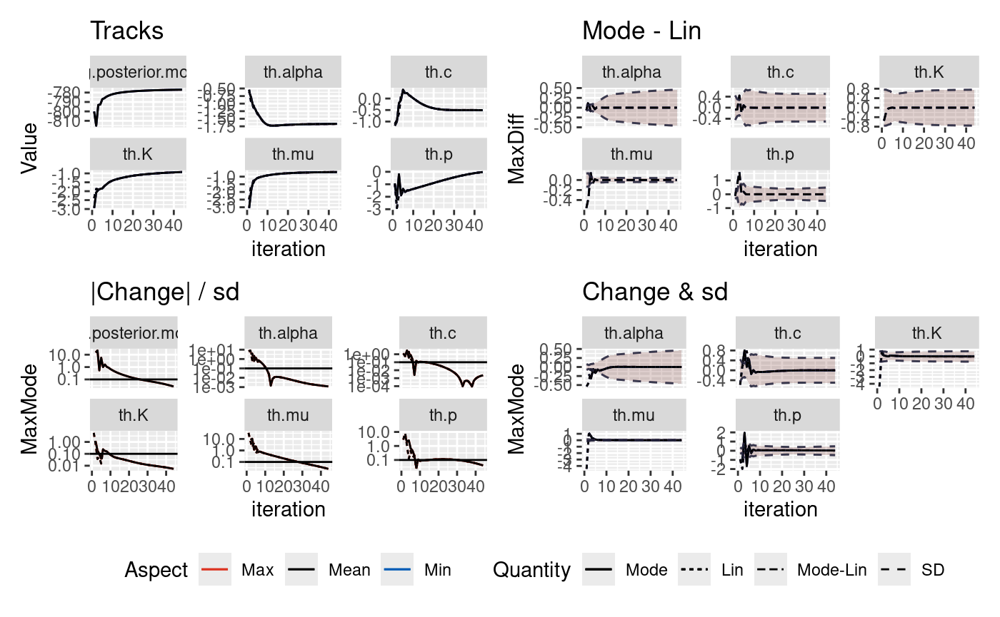

# Sensitivity to starting point

## Multiple analyses of two catalogues using different initial values

The inlabru algorithm takes an initial guess on the mode of the
parameters we are inverting for and iteratively updates this initial
guess. There is the potential that there may be bad initial conditions
such that they find different solutions and the runtime will differ
depending upon how the solution converges.

In this notebook, we explore the robustness of the posteriors on two
synthetic catalogues where the true parameters are known. Both
catalogues contain 2000 days of data. One catalogue does not contain a
large event and the second contains a M6.7 event on day 1000.

``` r
library(ETAS.inlabru)

library(tidyquant)
library(gridExtra)
library(grid)
library(lemon)
library(ggplot2)
library(ggpubr)
library(GGally)

library(inlabru)
library(INLA)
library(ETAS.inlabru)

# inla.setOption(pardiso.license="~/sys/licences/pardiso.lic")

library(dplyr)

# Increase/decrease num.cores if you have more/fewer cores on your computer.
# future::multisession works on both Windows, MacOS, and Linux
num.cores <- 2
future::plan(future::multisession, workers = num.cores)
INLA::inla.setOption(num.threads = num.cores)
# To deactivate parallelism, run
#   future::plan(future::sequential)
#   INLA::inla.setOption(num.threads = 1)
```

### Define the parameters for the synthetic catalogues and starting values for inversion

``` r
# Parameters we use to generate synthetics, which we will refer to as the 'true'
# parameters
mu <- 0.1
K <- 0.089
alpha <- 2.29
c <- 0.11
p <- 1.08

# Format the true ETAS parameters for code to generate the synthetics
theta_etas <- data.frame(mu = mu, K = K, alpha = alpha, c = c, p = p)

# A dataframe containing different starting values for the algorithm
startingValues <- data.frame(
  mu = c(5., mu),
  K = c(1., K),
  alpha = c(5., alpha),
  c = c(0.3, c),
  p = c(1.5, p)
)
nRealisations <- length(startingValues$mu)


# Temporal duration of the synthetic catalogue in days
modelledDuration <- 1000 # [days]

# The minimum magnitude that will be modelled
M0 <- 2.5
```

### Generate new catalogues and save them

``` r
############
#### Generate the first catalogue with no large events

samp.etas.list <- generate_temporal_ETAS_synthetic(
  theta = theta_etas,
  beta.p = log(10), M0 = M0, T1 = 0, T2 = modelledDuration, Ht = NULL
)

quiet.ETAS.cat <- bind_rows(samp.etas.list)
quiet.ETAS.cat <- quiet.ETAS.cat[order(quiet.ETAS.cat$ts), ]
# quiet.ETAS.cat <- na.omit(quiet.ETAS.cat)
```

``` r
############
#### Generate the second catalogue with a M6.7 event on day 1000

# Impose a M6.7 event on day 1000
Ht <- data.frame(ts = c(500), magnitudes = c(6.7))

samp.etas.list <- generate_temporal_ETAS_synthetic(
  theta = theta_etas,
  beta.p = log(10),
  M0 = M0,
  T1 = 0,
  T2 = modelledDuration,
  Ht = Ht
)

M6p7.ETAS.cat <- bind_rows(samp.etas.list)
M6p7.ETAS.cat <- M6p7.ETAS.cat[order(M6p7.ETAS.cat$ts), ]
```

In this vignette we use Rmd caching, but you can save the catalogues in
files explicitly:

``` r
# save(M6p7.ETAS.cat,file="M6p7_ETAS_cat.Rda")
# save(quiet.ETAS.cat,file="quiet.ETAS.cat.Rda")
```

## Present the catalogues

### Load the catalogues

To read from saved object files:

``` r
# load("M6p7_ETAS_cat.Rda")
# load("quiet.ETAS.cat.Rda")
```

### Plot properties of the catalogues

``` r
plots <- list()

plots[[1]] <- ggplot() +
  geom_point(
    data = quiet.ETAS.cat,
    aes(x = ts, y = magnitudes),
    size = 0.1,
    alpha = 0.5
  ) +
  xlim(0, modelledDuration) +
  ggtitle(paste("A.  Unseeded catalog, nEvents =", length(quiet.ETAS.cat$ts))) +
  ylim(2, 7) +
  xlab("Time [days]") +
  ylab("Magnitude") +
  theme_bw()

plots[[2]] <- ggplot() +
  geom_point(
    data = M6p7.ETAS.cat,
    aes(x = ts, y = magnitudes),
    size = 0.1,
    alpha = 0.5
  ) +
  xlim(0, modelledDuration) +
  ggtitle(paste(
    "B.  Catalog seeded with M6.7 event on day 500, nEvents =",
    length(M6p7.ETAS.cat$ts)
  )) +
  ylim(2, 7) +
  xlab("Time [days]") +
  ylab("Magnitude") +
  theme_bw()


plt <- grid.arrange(plots[[1]], plots[[2]], ncol = 1, nrow = 2)
```


``` r

# ggsave("initialConditionCats.png", plt)
# ggsave("initialConditionCats.pdf", plt)
```

## Analyse the sensitivity to starting conditions

### Analysis of quiet catalogue

``` r
list.output.quietScenario <- list()

for (i in seq_len(nRealisations)) {
  if (exists("list.input")) remove("list.input")

  # Load a set of parameters that we will need to tweak for this application
  fpath <- system.file("extdata",
    "user_input_synthetic_noCatalogue.txt",
    package = "ETAS.inlabru"
  )
  list.input <- create_input_list_temporal_noCatalogue(fpath)

  ####################
  # Tweak the variables loaded from the input file
  list.input$M0 <- M0
  list.input$time.int <- c(0, modelledDuration)
  list.input$T12 <- c(0, modelledDuration)

  # Change the starting location, measured on the ETAS scale
  list.input$mu.init <- startingValues$mu[i]
  list.input$alpha.init <- startingValues$alpha[i]
  list.input$K.init <- startingValues$K[i]
  list.input$c.init <- startingValues$c[i]
  list.input$p.init <- startingValues$p[i]

  link.f <- list(
    mu = \(x) gamma_t(x, a_mu, b_mu),
    K = \(x) loggaus_t(x, a_K, b_K),
    alpha = \(x) unif_t(x, a_alpha, b_alpha),
    c_ = \(x) unif_t(x, a_c, b_c),
    p = \(x) unif_t(x, a_p, b_p)
  )

  # initial value - convert from ETAS scale to internal scale
  list.input$th.init <- list(
    th.mu = inv_gamma_t(list.input$mu.init, list.input$a_mu, list.input$b_mu),
    th.K = inv_loggaus_t(list.input$K.init, list.input$a_K, list.input$b_K),
    th.alpha = inv_unif_t(
      list.input$alpha.init,
      list.input$a_alpha,
      list.input$b_alpha
    ),
    th.c = inv_unif_t(list.input$c.init, list.input$a_c, list.input$b_c),
    th.p = inv_unif_t(list.input$p.init, list.input$a_p, list.input$b_p)
  )

  # Define options for inlabru
  if (is.null(list.input$max_step)) {
    list.input$bru.opt.list <- list(
      bru_verbose = 0, # type of visual output
      bru_max_iter = list.input$max_iter, # maximum number of iterations
      # bru_method = list(max_step = 0.5),
      bru_initial = list.input$th.init
    ) # parameters initial values
  } else {
    list.input$bru.opt.list <- list(
      bru_verbose = 0, # type of visual output
      bru_max_iter = list.input$max_iter, # maximum number of iterations
      bru_method = list(max_step = list.input$max_step),
      bru_initial = list.input$th.init
    ) # parameters initial values
  }

  ## Add out catalogue to the input list
  list.input$catalog <- data.frame(
    time_diff = quiet.ETAS.cat$ts,
    magnitudes = quiet.ETAS.cat$magnitudes
  )

  ## Add the catalogue formatted for bru
  list.input$catalog.bru <- data.frame(
    ts = quiet.ETAS.cat$ts,
    magnitudes = quiet.ETAS.cat$magnitudes,
    idx.p = seq_len(nrow(quiet.ETAS.cat))
  )

  ## Input list is now formatted
  ####################

  ## Run the model according to the input list
  ETAS.model.fit <- Temporal.ETAS.fit(list.input)

  ## Small bit of post processing
  list.output.quietScenario[[i]] <-
    append(list.input, list(model.fit = ETAS.model.fit))
  list.output.quietScenario[[i]]$runtime <-
    sum(list.output.quietScenario[[i]]$model.fit$bru_timings$Time)
  list.output.quietScenario[[i]]$nEvents <-
    length(list.output.quietScenario[[i]]$catalog[, 1])
}
#> Start model fitting 
#> Start creating grid... 
#> Finished creating grid, time  0.1698925 
#> Finish model fitting 
#> Start model fitting 
#> Start creating grid... 
#> Finished creating grid, time  0.1703124 
#> Finish model fitting
```

### Analysis of M6.7 catalogue

``` r
list.output.M6p7Scenario <- list()

for (i in seq_len(nRealisations)) {
  if (exists("list.input")) {
    remove(list.input)
  }

  # Load a set of parameters that we will need to tweak for this application
  fpath <- system.file("extdata",
    "user_input_synthetic_noCatalogue.txt",
    package = "ETAS.inlabru"
  )
  list.input <- create_input_list_temporal_noCatalogue(fpath)

  ####################
  # Tweak the variables laoded from the input file
  list.input$M0 <- M0
  list.input$time.int <- c(0, modelledDuration)
  list.input$T12 <- c(0, modelledDuration)

  # Change the starting location, measured on the ETAS scale
  list.input$mu.init <- startingValues$mu[i]
  list.input$alpha.init <- startingValues$alpha[i]
  list.input$K.init <- startingValues$K[i]
  list.input$c.init <- startingValues$c[i]
  list.input$p.init <- startingValues$p[i]

  link.f <- list(
    mu = \(x) gamma_t(x, a_mu, b_mu),
    K = \(x) loggaus_t(x, a_K, b_K),
    alpha = \(x) unif_t(x, a_alpha, b_alpha),
    c_ = \(x) unif_t(x, a_c, b_c),
    p = \(x) unif_t(x, a_p, b_p)
  )

  # initial value - convert from ETAS scale to internal scale
  list.input$th.init <- list(
    th.mu = inv_gamma_t(list.input$mu.init, list.input$a_mu, list.input$b_mu),
    th.K = inv_loggaus_t(list.input$K.init, list.input$a_K, list.input$b_K),
    th.alpha = inv_unif_t(
      list.input$alpha.init,
      list.input$a_alpha,
      list.input$b_alpha
    ),
    th.c = inv_unif_t(list.input$c.init, list.input$a_c, list.input$b_c),
    th.p = inv_unif_t(list.input$p.init, list.input$a_p, list.input$b_p)
  )

  # Define options for inlabru
  if (is.null(list.input$max_step)) {
    list.input$bru.opt.list <- list(
      bru_verbose = 4, # type of visual output
      bru_max_iter = list.input$max_iter, # maximum number of iterations
      # bru_method = list(max_step = 0.5),
      bru_initial = list.input$th.init
    ) # parameters initial values
  } else {
    list.input$bru.opt.list <- list(
      bru_verbose = 4, # type of visual output
      bru_max_iter = list.input$max_iter, # maximum number of iterations
      bru_method = list(max_step = list.input$max_step),
      bru_initial = list.input$th.init
    ) # parameters initial values
  }

  ## Add out catalogue to the input list
  list.input$catalog <- data.frame(
    time_diff = M6p7.ETAS.cat$ts,
    magnitudes = M6p7.ETAS.cat$magnitudes
  )

  ## Add the catalogue formatted for bru
  list.input$catalog.bru <- data.frame(
    ts = M6p7.ETAS.cat$ts,
    magnitudes = M6p7.ETAS.cat$magnitudes,
    idx.p = seq_len(nrow(M6p7.ETAS.cat))
  )

  ## Input list is now formatted
  ####################

  ## Run the model according to the input list
  ETAS.model.fit <- Temporal.ETAS.fit(list.input)

  ## Small bit of post processing
  list.output.M6p7Scenario[[i]] <-
    append(list.input, list(model.fit = ETAS.model.fit))
  list.output.M6p7Scenario[[i]]$runtime <-
    sum(list.output.M6p7Scenario[[i]]$model.fit$bru_timings$Time)
  list.output.M6p7Scenario[[i]]$nEvents <-
    length(list.output.M6p7Scenario[[i]]$catalog[, 1])
}
#> Start model fitting 
#> Start creating grid... 
#> Finished creating grid, time  12.04155
#> bru: Preprocessing
#> The `like()` function has been deprecated in favour of `bru_obs()`, since inlabru 2.12.0.
#> Evaluate component inputs for each observation model
#> bru_input(bru_comp_list)
#> bru_input.bru_comp(th.mu)
#> bru_input.bru_comp(th.K)
#> bru_input.bru_comp(th.alpha)
#> bru_input.bru_comp(th.c)
#> bru_input.bru_comp(th.p)
#> iinla: Start
#> iinla: Evaluate component linearisations
#> Linearise components for each observation model
#> Linearise component 'th.mu'
#> Linearise component 'th.K'
#> Linearise component 'th.alpha'
#> Linearise component 'th.c'
#> Linearise component 'th.p'
#> iinla: Evaluate component simplifications
#> Simplify component mappers for each observation model
#> Simplify component 'th.mu'
#> Simplify component 'th.K'
#> Simplify component 'th.alpha'
#> Simplify component 'th.c'
#> Simplify component 'th.p'
#> iinla: Evaluate predictor linearisation
#> iinla: Construct inla stack
#> iinla: Model initialisation completed
#> iinla: Iteration 1 [max:100]
#> iinla: Step rescaling: 96.82%, Approx Optimisation (norm0 = 19910, norm1 = 486.1, norm01 = 19950)
#> iinla: |lin1-lin0| = 19950
#>        <eta-lin1,delta>/|delta| = -42.85
#>        |eta-lin0 - delta <delta,eta-lin0>/<delta,delta>| = 484.2
#> iinla: Evaluate component linearisations
#> Linearise components for each observation model
#> Linearise component 'th.mu'
#> Linearise component 'th.K'
#> Linearise component 'th.alpha'
#> Linearise component 'th.c'
#> Linearise component 'th.p'
#> iinla: Evaluate predictor linearisation
#> iinla: Iteration 2 [max:100]
#> iinla: Step rescaling: 162%, Expand (norm0 = 5708, norm1 = 1694, norm01 = 4060)
#> iinla: Step rescaling: 100%, Overstep (norm0 = 3666, norm1 = 452.2, norm01 = 4060)
#> iinla: Step rescaling: 111.2%, Approx Optimisation (norm0 = 4045, norm1 = 253.7, norm01 = 4060)
#> iinla: |lin1-lin0| = 4060
#>        <eta-lin1,delta>/|delta| = -23.39
#>        |eta-lin0 - delta <delta,eta-lin0>/<delta,delta>| = 252.7
#> iinla: Evaluate component linearisations
#> Linearise components for each observation model
#> Linearise component 'th.mu'
#> Linearise component 'th.K'
#> Linearise component 'th.alpha'
#> Linearise component 'th.c'
#> Linearise component 'th.p'
#> iinla: Evaluate predictor linearisation
#> iinla: Max deviation from previous: 1710% of SD, and line search is active
#>        [stop if: <10% and line search inactive]
#> iinla: Iteration 3 [max:100]
#> iinla: Step rescaling: 162%, Expand (norm0 = 4432, norm1 = 1539, norm01 = 2897)
#> iinla: Step rescaling: 100%, Overstep (norm0 = 2773, norm1 = 143.4, norm01 = 2897)
#> iinla: Step rescaling: 104.6%, Approx Optimisation (norm0 = 2896, norm1 = 74.64, norm01 = 2897)
#> iinla: |lin1-lin0| = 2897
#>        <eta-lin1,delta>/|delta| = -1.69
#>        |eta-lin0 - delta <delta,eta-lin0>/<delta,delta>| = 74.62
#> iinla: Evaluate component linearisations
#> Linearise components for each observation model
#> Linearise component 'th.mu'
#> Linearise component 'th.K'
#> Linearise component 'th.alpha'
#> Linearise component 'th.c'
#> Linearise component 'th.p'
#> iinla: Evaluate predictor linearisation
#> iinla: Max deviation from previous: 1900% of SD, and line search is active
#>        [stop if: <10% and line search inactive]
#> iinla: Iteration 4 [max:100]
#> iinla: Step rescaling: 162%, Expand (norm0 = 4103000, norm1 = 1401000, norm01 = 2853000)
#> iinla: Step rescaling: 105.8%, Approx Optimisation (norm0 = 2330000, norm1 = 1302000, norm01 = 2853000)
#> iinla: |lin1-lin0| = 2853000
#>        <eta-lin1,delta>/|delta| = -772100
#>        |eta-lin0 - delta <delta,eta-lin0>/<delta,delta>| = 1048000
#> iinla: Evaluate component linearisations
#> Linearise components for each observation model
#> Linearise component 'th.mu'
#> Linearise component 'th.K'
#> Linearise component 'th.alpha'
#> Linearise component 'th.c'
#> Linearise component 'th.p'
#> iinla: Evaluate predictor linearisation
#> iinla: Max deviation from previous: 1950000% of SD, and line search is active
#>        [stop if: <10% and line search inactive]
#> iinla: Iteration 5 [max:100]
#> iinla: Step rescaling: 67.53%, Approx Optimisation (norm0 = 10480, norm1 = 3599, norm01 = 9709)
#> iinla: |lin1-lin0| = 9709
#>        <eta-lin1,delta>/|delta| = 135.7
#>        |eta-lin0 - delta <delta,eta-lin0>/<delta,delta>| = 3596
#> iinla: Evaluate component linearisations
#> Linearise components for each observation model
#> Linearise component 'th.mu'
#> Linearise component 'th.K'
#> Linearise component 'th.alpha'
#> Linearise component 'th.c'
#> Linearise component 'th.p'
#> iinla: Evaluate predictor linearisation
#> iinla: Max deviation from previous: 7610% of SD, and line search is active
#>        [stop if: <10% and line search inactive]
#> iinla: Iteration 6 [max:100]
#> iinla: Step rescaling: 162%, Expand (norm0 = Inf, norm1 = Inf, norm01 = 8075)
#> iinla: Step rescaling: 100%, Overstep (norm0 = 6315, norm1 = 2751, norm01 = 8075)
#> iinla: Step rescaling: 102.9%, Approx Optimisation (norm0 = 8462, norm1 = 2636, norm01 = 8075)
#> iinla: |lin1-lin0| = 8075
#>        <eta-lin1,delta>/|delta| = -33.82
#>        |eta-lin0 - delta <delta,eta-lin0>/<delta,delta>| = 2635
#> iinla: Evaluate component linearisations
#> Linearise components for each observation model
#> Linearise component 'th.mu'
#> Linearise component 'th.K'
#> Linearise component 'th.alpha'
#> Linearise component 'th.c'
#> Linearise component 'th.p'
#> iinla: Evaluate predictor linearisation
#> iinla: Max deviation from previous: 3720% of SD, and line search is active
#>        [stop if: <10% and line search inactive]
#> iinla: Iteration 7 [max:100]
#> iinla: Step rescaling: 61.8%, Contract (norm0 = 1186, norm1 = 2029, norm01 = 1060)
#> iinla: Step rescaling: 38.2%, Contract (norm0 = 230.5, norm1 = 927.4, norm01 = 1060)
#> iinla: Step rescaling: 28.23%, Approx Optimisation (norm0 = 213.8, norm1 = 859.7, norm01 = 1060)
#> iinla: |lin1-lin0| = 1060
#>        <eta-lin1,delta>/|delta| = -857.1
#>        |eta-lin0 - delta <delta,eta-lin0>/<delta,delta>| = 66.43
#> iinla: Evaluate component linearisations
#> Linearise components for each observation model
#> Linearise component 'th.mu'
#> Linearise component 'th.K'
#> Linearise component 'th.alpha'
#> Linearise component 'th.c'
#> Linearise component 'th.p'
#> iinla: Evaluate predictor linearisation
#> iinla: Max deviation from previous: 2600% of SD, and line search is active
#>        [stop if: <10% and line search inactive]
#> iinla: Iteration 8 [max:100]
#> iinla: Step rescaling: 61.8%, Contract (norm0 = 58720, norm1 = 59800, norm01 = 1462)
#> iinla: Step rescaling: 38.2%, Contract (norm0 = 16230, norm1 = 17170, norm01 = 1462)
#> iinla: Step rescaling: 23.61%, Contract (norm0 = 4182, norm1 = 5023, norm01 = 1462)
#> iinla: Step rescaling: 14.59%, Contract (norm0 = 1140, norm1 = 2129, norm01 = 1462)
#> iinla: Step rescaling: 5.578%, Approx Optimisation (norm0 = 112.4, norm1 = 1442, norm01 = 1462)
#> iinla: |lin1-lin0| = 1462
#>        <eta-lin1,delta>/|delta| = -1438
#>        |eta-lin0 - delta <delta,eta-lin0>/<delta,delta>| = 109.7
#> iinla: Evaluate component linearisations
#> Linearise components for each observation model
#> Linearise component 'th.mu'
#> Linearise component 'th.K'
#> Linearise component 'th.alpha'
#> Linearise component 'th.c'
#> Linearise component 'th.p'
#> iinla: Evaluate predictor linearisation
#> iinla: Max deviation from previous: 1210% of SD, and line search is active
#>        [stop if: <10% and line search inactive]
#> iinla: Iteration 9 [max:100]
#> iinla: Step rescaling: 61.8%, Contract (norm0 = 15390, norm1 = 16400, norm01 = 1734)
#> iinla: Step rescaling: 38.2%, Contract (norm0 = 4498, norm1 = 5368, norm01 = 1734)
#> iinla: Step rescaling: 23.61%, Contract (norm0 = 1379, norm1 = 2389, norm01 = 1734)
#> iinla: Step rescaling: 9.024%, Approx Optimisation (norm0 = 182.8, norm1 = 1655, norm01 = 1734)
#> iinla: |lin1-lin0| = 1734
#>        <eta-lin1,delta>/|delta| = -1647
#>        |eta-lin0 - delta <delta,eta-lin0>/<delta,delta>| = 161
#> iinla: Evaluate component linearisations
#> Linearise components for each observation model
#> Linearise component 'th.mu'
#> Linearise component 'th.K'
#> Linearise component 'th.alpha'
#> Linearise component 'th.c'
#> Linearise component 'th.p'
#> iinla: Evaluate predictor linearisation
#> iinla: Max deviation from previous: 1230% of SD, and line search is active
#>        [stop if: <10% and line search inactive]
#> iinla: Iteration 10 [max:100]
#> iinla: Step rescaling: 61.8%, Contract (norm0 = 3451, norm1 = 4396, norm01 = 1797)
#> iinla: Step rescaling: 38.2%, Contract (norm0 = 1139, norm1 = 2144, norm01 = 1797)
#> iinla: Step rescaling: 15.62%, Approx Optimisation (norm0 = 250.3, norm1 = 1623, norm01 = 1797)
#> iinla: |lin1-lin0| = 1797
#>        <eta-lin1,delta>/|delta| = -1614
#>        |eta-lin0 - delta <delta,eta-lin0>/<delta,delta>| = 171.2
#> iinla: Evaluate component linearisations
#> Linearise components for each observation model
#> Linearise component 'th.mu'
#> Linearise component 'th.K'
#> Linearise component 'th.alpha'
#> Linearise component 'th.c'
#> Linearise component 'th.p'
#> iinla: Evaluate predictor linearisation
#> iinla: Max deviation from previous: 1280% of SD, and line search is active
#>        [stop if: <10% and line search inactive]
#> iinla: Iteration 11 [max:100]
#> iinla: Step rescaling: 61.8%, Contract (norm0 = 1052, norm1 = 1897, norm01 = 1778)
#> iinla: Step rescaling: 30.99%, Approx Optimisation (norm0 = 427.8, norm1 = 1452, norm01 = 1778)
#> iinla: |lin1-lin0| = 1778
#>        <eta-lin1,delta>/|delta| = -1430
#>        |eta-lin0 - delta <delta,eta-lin0>/<delta,delta>| = 248.5
#> iinla: Evaluate component linearisations
#> Linearise components for each observation model
#> Linearise component 'th.mu'
#> Linearise component 'th.K'
#> Linearise component 'th.alpha'
#> Linearise component 'th.c'
#> Linearise component 'th.p'
#> iinla: Evaluate predictor linearisation
#> iinla: Max deviation from previous: 716% of SD, and line search is active
#>        [stop if: <10% and line search inactive]
#> iinla: Iteration 12 [max:100]
#> iinla: Step rescaling: 162%, Expand (norm0 = 1764, norm1 = 2480, norm01 = 1727)
#> iinla: Step rescaling: 100%, Overstep (norm0 = 1013, norm1 = 1192, norm01 = 1727)
#> iinla: Step rescaling: 71.07%, Approx Optimisation (norm0 = 829.9, norm1 = 1031, norm01 = 1727)
#> iinla: |lin1-lin0| = 1727
#>        <eta-lin1,delta>/|delta| = -971.4
#>        |eta-lin0 - delta <delta,eta-lin0>/<delta,delta>| = 344.2
#> iinla: Evaluate component linearisations
#> Linearise components for each observation model
#> Linearise component 'th.mu'
#> Linearise component 'th.K'
#> Linearise component 'th.alpha'
#> Linearise component 'th.c'
#> Linearise component 'th.p'
#> iinla: Evaluate predictor linearisation
#> iinla: Max deviation from previous: 377% of SD, and line search is active
#>        [stop if: <10% and line search inactive]
#> iinla: Iteration 13 [max:100]
#> iinla: Step rescaling: 162%, Expand (norm0 = 2152, norm1 = 561.8, norm01 = 1609)
#> iinla: Step rescaling: 100%, Overstep (norm0 = 1438, norm1 = 185.4, norm01 = 1609)
#> iinla: Step rescaling: 113.1%, Approx Optimisation (norm0 = 1600, norm1 = 85.11, norm01 = 1609)
#> iinla: |lin1-lin0| = 1609
#>        <eta-lin1,delta>/|delta| = -11.08
#>        |eta-lin0 - delta <delta,eta-lin0>/<delta,delta>| = 84.38
#> iinla: Evaluate component linearisations
#> Linearise components for each observation model
#> Linearise component 'th.mu'
#> Linearise component 'th.K'
#> Linearise component 'th.alpha'
#> Linearise component 'th.c'
#> Linearise component 'th.p'
#> iinla: Evaluate predictor linearisation
#> iinla: Max deviation from previous: 426% of SD, and line search is active
#>        [stop if: <10% and line search inactive]
#> iinla: Iteration 14 [max:100]
#> iinla: Step rescaling: 162%, Expand (norm0 = 1247, norm1 = 450.4, norm01 = 797.4)
#> iinla: Step rescaling: 100%, Overstep (norm0 = 780.8, norm1 = 18.52, norm01 = 797.4)
#> iinla: Step rescaling: 102.2%, Approx Optimisation (norm0 = 797.3, norm1 = 8.522, norm01 = 797.4)
#> iinla: |lin1-lin0| = 797.4
#>        <eta-lin1,delta>/|delta| = -0.181
#>        |eta-lin0 - delta <delta,eta-lin0>/<delta,delta>| = 8.52
#> iinla: Evaluate component linearisations
#> Linearise components for each observation model
#> Linearise component 'th.mu'
#> Linearise component 'th.K'
#> Linearise component 'th.alpha'
#> Linearise component 'th.c'
#> Linearise component 'th.p'
#> iinla: Evaluate predictor linearisation
#> iinla: Max deviation from previous: 370% of SD, and line search is active
#>        [stop if: <10% and line search inactive]
#> iinla: Iteration 15 [max:100]
#> iinla: Step rescaling: 162%, Expand (norm0 = 969.4, norm1 = 368.5, norm01 = 600.9)
#> iinla: Step rescaling: 100%, Overstep (norm0 = 599.8, norm1 = 1.201, norm01 = 600.9)
#> iinla: Step rescaling: 100.2%, Approx Optimisation (norm0 = 600.9, norm1 = 0.4557, norm01 = 600.9)
#> iinla: |lin1-lin0| = 600.9
#>        <eta-lin1,delta>/|delta| = -3.024e-05
#>        |eta-lin0 - delta <delta,eta-lin0>/<delta,delta>| = 0.4557
#> iinla: Evaluate component linearisations
#> Linearise components for each observation model
#> Linearise component 'th.mu'
#> Linearise component 'th.K'
#> Linearise component 'th.alpha'
#> Linearise component 'th.c'
#> Linearise component 'th.p'
#> iinla: Evaluate predictor linearisation
#> iinla: Max deviation from previous: 265% of SD, and line search is active
#>        [stop if: <10% and line search inactive]
#> iinla: Iteration 16 [max:100]
#> iinla: Step rescaling: 162%, Expand (norm0 = 860.3, norm1 = 328.3, norm01 = 532)
#> iinla: Step rescaling: 100%, Overstep (norm0 = 531.8, norm1 = 0.325, norm01 = 532)
#> iinla: Step rescaling: 100%, Approx Optimisation (norm0 = 532, norm1 = 0.273, norm01 = 532)
#> iinla: |lin1-lin0| = 532
#>        <eta-lin1,delta>/|delta| = 0.003513
#>        |eta-lin0 - delta <delta,eta-lin0>/<delta,delta>| = 0.2729
#> iinla: Evaluate component linearisations
#> Linearise components for each observation model
#> Linearise component 'th.mu'
#> Linearise component 'th.K'
#> Linearise component 'th.alpha'
#> Linearise component 'th.c'
#> Linearise component 'th.p'
#> iinla: Evaluate predictor linearisation
#> iinla: Max deviation from previous: 235% of SD, and line search is inactive
#>        [stop if: <10% and line search inactive]
#> iinla: Iteration 17 [max:100]
#> iinla: Step rescaling: 162%, Expand (norm0 = 792.5, norm1 = 301.7, norm01 = 490.8)
#> iinla: Step rescaling: 100%, Overstep (norm0 = 490.2, norm1 = 0.7691, norm01 = 490.8)
#> iinla: Step rescaling: 100.1%, Approx Optimisation (norm0 = 490.8, norm1 = 0.4791, norm01 = 490.8)
#> iinla: |lin1-lin0| = 490.8
#>        <eta-lin1,delta>/|delta| = -0.007576
#>        |eta-lin0 - delta <delta,eta-lin0>/<delta,delta>| = 0.479
#> iinla: Evaluate component linearisations
#> Linearise components for each observation model
#> Linearise component 'th.mu'
#> Linearise component 'th.K'
#> Linearise component 'th.alpha'
#> Linearise component 'th.c'
#> Linearise component 'th.p'
#> iinla: Evaluate predictor linearisation
#> iinla: Max deviation from previous: 218% of SD, and line search is active
#>        [stop if: <10% and line search inactive]
#> iinla: Iteration 18 [max:100]
#> iinla: Step rescaling: 162%, Expand (norm0 = 737.5, norm1 = 280.3, norm01 = 457.1)
#> iinla: Step rescaling: 100%, Overstep (norm0 = 456.3, norm1 = 1.06, norm01 = 457.1)
#> iinla: Step rescaling: 100.2%, Approx Optimisation (norm0 = 457.1, norm1 = 0.6571, norm01 = 457.1)
#> iinla: |lin1-lin0| = 457.1
#>        <eta-lin1,delta>/|delta| = -0.001746
#>        |eta-lin0 - delta <delta,eta-lin0>/<delta,delta>| = 0.6571
#> iinla: Evaluate component linearisations
#> Linearise components for each observation model
#> Linearise component 'th.mu'
#> Linearise component 'th.K'
#> Linearise component 'th.alpha'
#> Linearise component 'th.c'
#> Linearise component 'th.p'
#> iinla: Evaluate predictor linearisation
#> iinla: Max deviation from previous: 205% of SD, and line search is active
#>        [stop if: <10% and line search inactive]
#> iinla: Iteration 19 [max:100]
#> iinla: Step rescaling: 162%, Expand (norm0 = 688.6, norm1 = 261.5, norm01 = 427)
#> iinla: Step rescaling: 100%, Overstep (norm0 = 426.1, norm1 = 1.154, norm01 = 427)
#> iinla: Step rescaling: 100.2%, Approx Optimisation (norm0 = 427, norm1 = 0.7185, norm01 = 427)
#> iinla: |lin1-lin0| = 427
#>        <eta-lin1,delta>/|delta| = 0.0007221
#>        |eta-lin0 - delta <delta,eta-lin0>/<delta,delta>| = 0.7185
#> iinla: Evaluate component linearisations
#> Linearise components for each observation model
#> Linearise component 'th.mu'
#> Linearise component 'th.K'
#> Linearise component 'th.alpha'
#> Linearise component 'th.c'
#> Linearise component 'th.p'
#> iinla: Evaluate predictor linearisation
#> iinla: Max deviation from previous: 192% of SD, and line search is active
#>        [stop if: <10% and line search inactive]
#> iinla: Iteration 20 [max:100]
#> iinla: Step rescaling: 162%, Expand (norm0 = 644.4, norm1 = 244.7, norm01 = 399.7)
#> iinla: Step rescaling: 100%, Overstep (norm0 = 398.8, norm1 = 1.142, norm01 = 399.7)
#> iinla: Step rescaling: 100.2%, Approx Optimisation (norm0 = 399.7, norm1 = 0.7145, norm01 = 399.7)
#> iinla: |lin1-lin0| = 399.7
#>        <eta-lin1,delta>/|delta| = 0.001507
#>        |eta-lin0 - delta <delta,eta-lin0>/<delta,delta>| = 0.7145
#> iinla: Evaluate component linearisations
#> Linearise components for each observation model
#> Linearise component 'th.mu'
#> Linearise component 'th.K'
#> Linearise component 'th.alpha'
#> Linearise component 'th.c'
#> Linearise component 'th.p'
#> iinla: Evaluate predictor linearisation
#> iinla: Max deviation from previous: 181% of SD, and line search is active
#>        [stop if: <10% and line search inactive]
#> iinla: Iteration 21 [max:100]
#> iinla: Step rescaling: 162%, Expand (norm0 = 604.3, norm1 = 229.4, norm01 = 374.8)
#> iinla: Step rescaling: 100%, Overstep (norm0 = 374, norm1 = 1.08, norm01 = 374.8)
#> iinla: Step rescaling: 100.2%, Approx Optimisation (norm0 = 374.8, norm1 = 0.6781, norm01 = 374.8)
#> iinla: |lin1-lin0| = 374.8
#>        <eta-lin1,delta>/|delta| = 0.001478
#>        |eta-lin0 - delta <delta,eta-lin0>/<delta,delta>| = 0.6781
#> iinla: Evaluate component linearisations
#> Linearise components for each observation model
#> Linearise component 'th.mu'
#> Linearise component 'th.K'
#> Linearise component 'th.alpha'
#> Linearise component 'th.c'
#> Linearise component 'th.p'
#> iinla: Evaluate predictor linearisation
#> iinla: Max deviation from previous: 171% of SD, and line search is active
#>        [stop if: <10% and line search inactive]
#> iinla: Iteration 22 [max:100]
#> iinla: Step rescaling: 162%, Expand (norm0 = 567.6, norm1 = 215.5, norm01 = 352.1)
#> iinla: Step rescaling: 100%, Overstep (norm0 = 351.3, norm1 = 0.9983, norm01 = 352.1)
#> iinla: Step rescaling: 100.2%, Approx Optimisation (norm0 = 352.1, norm1 = 0.6288, norm01 = 352.1)
#> iinla: |lin1-lin0| = 352.1
#>        <eta-lin1,delta>/|delta| = 0.001103
#>        |eta-lin0 - delta <delta,eta-lin0>/<delta,delta>| = 0.6288
#> iinla: Evaluate component linearisations
#> Linearise components for each observation model
#> Linearise component 'th.mu'
#> Linearise component 'th.K'
#> Linearise component 'th.alpha'
#> Linearise component 'th.c'
#> Linearise component 'th.p'
#> iinla: Evaluate predictor linearisation
#> iinla: Max deviation from previous: 161% of SD, and line search is active
#>        [stop if: <10% and line search inactive]
#> iinla: Iteration 23 [max:100]
#> iinla: Step rescaling: 162%, Expand (norm0 = 534, norm1 = 202.8, norm01 = 331.2)
#> iinla: Step rescaling: 100%, Overstep (norm0 = 330.5, norm1 = 0.9116, norm01 = 331.2)
#> iinla: Step rescaling: 100.2%, Approx Optimisation (norm0 = 331.2, norm1 = 0.5758, norm01 = 331.2)
#> iinla: |lin1-lin0| = 331.2
#>        <eta-lin1,delta>/|delta| = 0.0006013
#>        |eta-lin0 - delta <delta,eta-lin0>/<delta,delta>| = 0.5758
#> iinla: Evaluate component linearisations
#> Linearise components for each observation model
#> Linearise component 'th.mu'
#> Linearise component 'th.K'
#> Linearise component 'th.alpha'
#> Linearise component 'th.c'
#> Linearise component 'th.p'
#> iinla: Evaluate predictor linearisation
#> iinla: Max deviation from previous: 152% of SD, and line search is active
#>        [stop if: <10% and line search inactive]
#> iinla: Iteration 24 [max:100]
#> iinla: Step rescaling: 162%, Expand (norm0 = 503, norm1 = 191.1, norm01 = 311.9)
#> iinla: Step rescaling: 100%, Overstep (norm0 = 311.3, norm1 = 0.8273, norm01 = 311.9)
#> iinla: Step rescaling: 100.2%, Approx Optimisation (norm0 = 311.9, norm1 = 0.5239, norm01 = 311.9)
#> iinla: |lin1-lin0| = 311.9
#>        <eta-lin1,delta>/|delta| = 8.205e-05
#>        |eta-lin0 - delta <delta,eta-lin0>/<delta,delta>| = 0.5239
#> iinla: Evaluate component linearisations
#> Linearise components for each observation model
#> Linearise component 'th.mu'
#> Linearise component 'th.K'
#> Linearise component 'th.alpha'
#> Linearise component 'th.c'
#> Linearise component 'th.p'
#> iinla: Evaluate predictor linearisation
#> iinla: Max deviation from previous: 144% of SD, and line search is active
#>        [stop if: <10% and line search inactive]
#> iinla: Iteration 25 [max:100]
#> iinla: Step rescaling: 162%, Expand (norm0 = 474.4, norm1 = 180.2, norm01 = 294.1)
#> iinla: Step rescaling: 100%, Overstep (norm0 = 293.5, norm1 = 0.7485, norm01 = 294.1)
#> iinla: Step rescaling: 100.2%, Approx Optimisation (norm0 = 294.1, norm1 = 0.4751, norm01 = 294.1)
#> iinla: |lin1-lin0| = 294.1
#>        <eta-lin1,delta>/|delta| = -0.0004053
#>        |eta-lin0 - delta <delta,eta-lin0>/<delta,delta>| = 0.4751
#> iinla: Evaluate component linearisations
#> Linearise components for each observation model
#> Linearise component 'th.mu'
#> Linearise component 'th.K'
#> Linearise component 'th.alpha'
#> Linearise component 'th.c'
#> Linearise component 'th.p'
#> iinla: Evaluate predictor linearisation
#> iinla: Max deviation from previous: 136% of SD, and line search is active
#>        [stop if: <10% and line search inactive]
#> iinla: Iteration 26 [max:100]
#> iinla: Step rescaling: 162%, Expand (norm0 = 447.8, norm1 = 170.2, norm01 = 277.6)
#> iinla: Step rescaling: 100%, Overstep (norm0 = 277.1, norm1 = 0.6765, norm01 = 277.6)
#> iinla: Step rescaling: 100.2%, Approx Optimisation (norm0 = 277.6, norm1 = 0.4304, norm01 = 277.6)
#> iinla: |lin1-lin0| = 277.6
#>        <eta-lin1,delta>/|delta| = -0.0008407
#>        |eta-lin0 - delta <delta,eta-lin0>/<delta,delta>| = 0.4304
#> iinla: Evaluate component linearisations
#> Linearise components for each observation model
#> Linearise component 'th.mu'
#> Linearise component 'th.K'
#> Linearise component 'th.alpha'
#> Linearise component 'th.c'
#> Linearise component 'th.p'
#> iinla: Evaluate predictor linearisation
#> iinla: Max deviation from previous: 129% of SD, and line search is active
#>        [stop if: <10% and line search inactive]
#> iinla: Iteration 27 [max:100]
#> iinla: Step rescaling: 162%, Expand (norm0 = 423.2, norm1 = 160.9, norm01 = 262.3)
#> iinla: Step rescaling: 100%, Overstep (norm0 = 261.9, norm1 = 0.6113, norm01 = 262.3)
#> iinla: Step rescaling: 100.2%, Approx Optimisation (norm0 = 262.3, norm1 = 0.3897, norm01 = 262.3)
#> iinla: |lin1-lin0| = 262.3
#>        <eta-lin1,delta>/|delta| = -0.001219
#>        |eta-lin0 - delta <delta,eta-lin0>/<delta,delta>| = 0.3897
#> iinla: Evaluate component linearisations
#> Linearise components for each observation model
#> Linearise component 'th.mu'
#> Linearise component 'th.K'
#> Linearise component 'th.alpha'
#> Linearise component 'th.c'
#> Linearise component 'th.p'
#> iinla: Evaluate predictor linearisation
#> iinla: Max deviation from previous: 122% of SD, and line search is active
#>        [stop if: <10% and line search inactive]
#> iinla: Iteration 28 [max:100]
#> iinla: Step rescaling: 162%, Expand (norm0 = 400.3, norm1 = 152.2, norm01 = 248.1)
#> iinla: Step rescaling: 100%, Overstep (norm0 = 247.7, norm1 = 0.5527, norm01 = 248.1)
#> iinla: Step rescaling: 100.2%, Approx Optimisation (norm0 = 248.1, norm1 = 0.353, norm01 = 248.1)
#> iinla: |lin1-lin0| = 248.1
#>        <eta-lin1,delta>/|delta| = -0.00154
#>        |eta-lin0 - delta <delta,eta-lin0>/<delta,delta>| = 0.353
#> iinla: Evaluate component linearisations
#> Linearise components for each observation model
#> Linearise component 'th.mu'
#> Linearise component 'th.K'
#> Linearise component 'th.alpha'
#> Linearise component 'th.c'
#> Linearise component 'th.p'
#> iinla: Evaluate predictor linearisation
#> iinla: Max deviation from previous: 116% of SD, and line search is active
#>        [stop if: <10% and line search inactive]
#> iinla: Iteration 29 [max:100]
#> iinla: Step rescaling: 162%, Expand (norm0 = 378.9, norm1 = 144.1, norm01 = 234.8)
#> iinla: Step rescaling: 100%, Overstep (norm0 = 234.4, norm1 = 0.5, norm01 = 234.8)
#> iinla: Step rescaling: 100.2%, Approx Optimisation (norm0 = 234.8, norm1 = 0.3199, norm01 = 234.8)
#> iinla: |lin1-lin0| = 234.8
#>        <eta-lin1,delta>/|delta| = -0.00181
#>        |eta-lin0 - delta <delta,eta-lin0>/<delta,delta>| = 0.3199
#> iinla: Evaluate component linearisations
#> Linearise components for each observation model
#> Linearise component 'th.mu'
#> Linearise component 'th.K'
#> Linearise component 'th.alpha'
#> Linearise component 'th.c'
#> Linearise component 'th.p'
#> iinla: Evaluate predictor linearisation
#> iinla: Max deviation from previous: 110% of SD, and line search is active
#>        [stop if: <10% and line search inactive]
#> iinla: Iteration 30 [max:100]
#> iinla: Step rescaling: 162%, Expand (norm0 = 359, norm1 = 136.6, norm01 = 222.5)
#> iinla: Step rescaling: 100%, Overstep (norm0 = 222.1, norm1 = 0.4524, norm01 = 222.5)
#> iinla: Step rescaling: 100.2%, Approx Optimisation (norm0 = 222.4, norm1 = 0.29, norm01 = 222.5)
#> iinla: |lin1-lin0| = 222.5
#>        <eta-lin1,delta>/|delta| = -0.002036
#>        |eta-lin0 - delta <delta,eta-lin0>/<delta,delta>| = 0.29
#> iinla: Evaluate component linearisations
#> Linearise components for each observation model
#> Linearise component 'th.mu'
#> Linearise component 'th.K'
#> Linearise component 'th.alpha'
#> Linearise component 'th.c'
#> Linearise component 'th.p'
#> iinla: Evaluate predictor linearisation
#> iinla: Max deviation from previous: 105% of SD, and line search is active
#>        [stop if: <10% and line search inactive]
#> iinla: Iteration 31 [max:100]
#> iinla: Step rescaling: 162%, Expand (norm0 = 340.3, norm1 = 129.5, norm01 = 210.9)
#> iinla: Step rescaling: 100%, Overstep (norm0 = 210.5, norm1 = 0.4102, norm01 = 210.9)
#> iinla: Step rescaling: 100.1%, Approx Optimisation (norm0 = 210.8, norm1 = 0.2634, norm01 = 210.9)
#> iinla: |lin1-lin0| = 210.9
#>        <eta-lin1,delta>/|delta| = -0.002215
#>        |eta-lin0 - delta <delta,eta-lin0>/<delta,delta>| = 0.2634
#> iinla: Evaluate component linearisations
#> Linearise components for each observation model
#> Linearise component 'th.mu'
#> Linearise component 'th.K'
#> Linearise component 'th.alpha'
#> Linearise component 'th.c'
#> Linearise component 'th.p'
#> iinla: Evaluate predictor linearisation
#> iinla: Max deviation from previous: 99.8% of SD, and line search is active
#>        [stop if: <10% and line search inactive]
#> iinla: Iteration 32 [max:100]
#> iinla: Step rescaling: 162%, Expand (norm0 = 322.8, norm1 = 122.8, norm01 = 200)
#> iinla: Step rescaling: 100%, Overstep (norm0 = 199.7, norm1 = 0.372, norm01 = 200)
#> iinla: Step rescaling: 100.1%, Approx Optimisation (norm0 = 200, norm1 = 0.2393, norm01 = 200)
#> iinla: |lin1-lin0| = 200
#>        <eta-lin1,delta>/|delta| = -0.00236
#>        |eta-lin0 - delta <delta,eta-lin0>/<delta,delta>| = 0.2393
#> iinla: Evaluate component linearisations
#> Linearise components for each observation model
#> Linearise component 'th.mu'
#> Linearise component 'th.K'
#> Linearise component 'th.alpha'
#> Linearise component 'th.c'
#> Linearise component 'th.p'
#> iinla: Evaluate predictor linearisation
#> iinla: Max deviation from previous: 94.9% of SD, and line search is active
#>        [stop if: <10% and line search inactive]
#> iinla: Iteration 33 [max:100]
#> iinla: Step rescaling: 162%, Expand (norm0 = 306.4, norm1 = 116.6, norm01 = 189.8)
#> iinla: Step rescaling: 100%, Overstep (norm0 = 189.5, norm1 = 0.3377, norm01 = 189.8)
#> iinla: Step rescaling: 100.1%, Approx Optimisation (norm0 = 189.8, norm1 = 0.2176, norm01 = 189.8)
#> iinla: |lin1-lin0| = 189.8
#>        <eta-lin1,delta>/|delta| = -0.002475
#>        |eta-lin0 - delta <delta,eta-lin0>/<delta,delta>| = 0.2175
#> iinla: Evaluate component linearisations
#> Linearise components for each observation model
#> Linearise component 'th.mu'
#> Linearise component 'th.K'
#> Linearise component 'th.alpha'
#> Linearise component 'th.c'
#> Linearise component 'th.p'
#> iinla: Evaluate predictor linearisation
#> iinla: Max deviation from previous: 90.3% of SD, and line search is active
#>        [stop if: <10% and line search inactive]
#> iinla: Iteration 34 [max:100]
#> iinla: Step rescaling: 162%, Expand (norm0 = 291, norm1 = 110.8, norm01 = 180.2)
#> iinla: Step rescaling: 100%, Overstep (norm0 = 180, norm1 = 0.3067, norm01 = 180.2)
#> iinla: Step rescaling: 100.1%, Approx Optimisation (norm0 = 180.2, norm1 = 0.1979, norm01 = 180.2)
#> iinla: |lin1-lin0| = 180.2
#>        <eta-lin1,delta>/|delta| = -0.002563
#>        |eta-lin0 - delta <delta,eta-lin0>/<delta,delta>| = 0.1979
#> iinla: Evaluate component linearisations
#> Linearise components for each observation model
#> Linearise component 'th.mu'
#> Linearise component 'th.K'
#> Linearise component 'th.alpha'
#> Linearise component 'th.c'
#> Linearise component 'th.p'
#> iinla: Evaluate predictor linearisation
#> iinla: Max deviation from previous: 86% of SD, and line search is active
#>        [stop if: <10% and line search inactive]
#> iinla: Iteration 35 [max:100]
#> iinla: Step rescaling: 162%, Expand (norm0 = 276.4, norm1 = 105.2, norm01 = 171.2)
#> iinla: Step rescaling: 100%, Overstep (norm0 = 171, norm1 = 0.2788, norm01 = 171.2)
#> iinla: Step rescaling: 100.1%, Approx Optimisation (norm0 = 171.2, norm1 = 0.1802, norm01 = 171.2)
#> iinla: |lin1-lin0| = 171.2
#>        <eta-lin1,delta>/|delta| = -0.002628
#>        |eta-lin0 - delta <delta,eta-lin0>/<delta,delta>| = 0.1801
#> iinla: Evaluate component linearisations
#> Linearise components for each observation model
#> Linearise component 'th.mu'
#> Linearise component 'th.K'
#> Linearise component 'th.alpha'
#> Linearise component 'th.c'
#> Linearise component 'th.p'
#> iinla: Evaluate predictor linearisation
#> iinla: Max deviation from previous: 82% of SD, and line search is active
#>        [stop if: <10% and line search inactive]
#> iinla: Iteration 36 [max:100]
#> iinla: Step rescaling: 162%, Expand (norm0 = 262.8, norm1 = 100, norm01 = 162.7)
#> iinla: Step rescaling: 100%, Overstep (norm0 = 162.5, norm1 = 0.2536, norm01 = 162.7)
#> iinla: Step rescaling: 100.1%, Approx Optimisation (norm0 = 162.7, norm1 = 0.1641, norm01 = 162.7)
#> iinla: |lin1-lin0| = 162.7
#>        <eta-lin1,delta>/|delta| = -0.002672
#>        |eta-lin0 - delta <delta,eta-lin0>/<delta,delta>| = 0.1641
#> iinla: Evaluate component linearisations
#> Linearise components for each observation model
#> Linearise component 'th.mu'
#> Linearise component 'th.K'
#> Linearise component 'th.alpha'
#> Linearise component 'th.c'
#> Linearise component 'th.p'
#> iinla: Evaluate predictor linearisation
#> iinla: Max deviation from previous: 78.1% of SD, and line search is active
#>        [stop if: <10% and line search inactive]
#> iinla: Iteration 37 [max:100]
#> iinla: Step rescaling: 162%, Expand (norm0 = 249.9, norm1 = 95.15, norm01 = 154.7)
#> iinla: Step rescaling: 100%, Overstep (norm0 = 154.5, norm1 = 0.2308, norm01 = 154.7)
#> iinla: Step rescaling: 100.1%, Approx Optimisation (norm0 = 154.7, norm1 = 0.1496, norm01 = 154.7)
#> iinla: |lin1-lin0| = 154.7
#>        <eta-lin1,delta>/|delta| = -0.002699
#>        |eta-lin0 - delta <delta,eta-lin0>/<delta,delta>| = 0.1495
#> iinla: Evaluate component linearisations
#> Linearise components for each observation model
#> Linearise component 'th.mu'
#> Linearise component 'th.K'
#> Linearise component 'th.alpha'
#> Linearise component 'th.c'
#> Linearise component 'th.p'
#> iinla: Evaluate predictor linearisation
#> iinla: Max deviation from previous: 74.5% of SD, and line search is active
#>        [stop if: <10% and line search inactive]
#> iinla: Iteration 38 [max:100]
#> iinla: Step rescaling: 162%, Expand (norm0 = 237.7, norm1 = 90.53, norm01 = 147.2)
#> iinla: Step rescaling: 100%, Overstep (norm0 = 147, norm1 = 0.2101, norm01 = 147.2)
#> iinla: Step rescaling: 100.1%, Approx Optimisation (norm0 = 147.2, norm1 = 0.1364, norm01 = 147.2)
#> iinla: |lin1-lin0| = 147.2
#>        <eta-lin1,delta>/|delta| = -0.002712
#>        |eta-lin0 - delta <delta,eta-lin0>/<delta,delta>| = 0.1363
#> iinla: Evaluate component linearisations
#> Linearise components for each observation model
#> Linearise component 'th.mu'
#> Linearise component 'th.K'
#> Linearise component 'th.alpha'
#> Linearise component 'th.c'
#> Linearise component 'th.p'
#> iinla: Evaluate predictor linearisation
#> iinla: Max deviation from previous: 71% of SD, and line search is active
#>        [stop if: <10% and line search inactive]
#> iinla: Iteration 39 [max:100]
#> iinla: Step rescaling: 162%, Expand (norm0 = 226.2, norm1 = 86.16, norm01 = 140)
#> iinla: Step rescaling: 100%, Overstep (norm0 = 139.9, norm1 = 0.1915, norm01 = 140)
#> iinla: Step rescaling: 100.1%, Approx Optimisation (norm0 = 140, norm1 = 0.1244, norm01 = 140)
#> iinla: |lin1-lin0| = 140
#>        <eta-lin1,delta>/|delta| = -0.002711
#>        |eta-lin0 - delta <delta,eta-lin0>/<delta,delta>| = 0.1244
#> iinla: Evaluate component linearisations
#> Linearise components for each observation model
#> Linearise component 'th.mu'
#> Linearise component 'th.K'
#> Linearise component 'th.alpha'
#> Linearise component 'th.c'
#> Linearise component 'th.p'
#> iinla: Evaluate predictor linearisation
#> iinla: Max deviation from previous: 67.7% of SD, and line search is active
#>        [stop if: <10% and line search inactive]
#> iinla: Iteration 40 [max:100]
#> iinla: Step rescaling: 162%, Expand (norm0 = 215.3, norm1 = 82.04, norm01 = 133.3)
#> iinla: Step rescaling: 100%, Overstep (norm0 = 133.2, norm1 = 0.1745, norm01 = 133.3)
#> iinla: Step rescaling: 100.1%, Approx Optimisation (norm0 = 133.3, norm1 = 0.1135, norm01 = 133.3)
#> iinla: |lin1-lin0| = 133.3
#>        <eta-lin1,delta>/|delta| = -0.0027
#>        |eta-lin0 - delta <delta,eta-lin0>/<delta,delta>| = 0.1135
#> iinla: Evaluate component linearisations
#> Linearise components for each observation model
#> Linearise component 'th.mu'
#> Linearise component 'th.K'
#> Linearise component 'th.alpha'
#> Linearise component 'th.c'
#> Linearise component 'th.p'
#> iinla: Evaluate predictor linearisation
#> iinla: Max deviation from previous: 64.6% of SD, and line search is inactive
#>        [stop if: <10% and line search inactive]
#> iinla: Iteration 41 [max:100]
#> iinla: Step rescaling: 162%, Expand (norm0 = 205, norm1 = 78.12, norm01 = 126.9)
#> iinla: Step rescaling: 100%, Overstep (norm0 = 126.8, norm1 = 0.1593, norm01 = 126.9)
#> iinla: Step rescaling: 100.1%, Approx Optimisation (norm0 = 126.9, norm1 = 0.1038, norm01 = 126.9)
#> iinla: |lin1-lin0| = 126.9
#>        <eta-lin1,delta>/|delta| = -0.002677
#>        |eta-lin0 - delta <delta,eta-lin0>/<delta,delta>| = 0.1037
#> iinla: Evaluate component linearisations
#> Linearise components for each observation model
#> Linearise component 'th.mu'
#> Linearise component 'th.K'
#> Linearise component 'th.alpha'
#> Linearise component 'th.c'
#> Linearise component 'th.p'
#> iinla: Evaluate predictor linearisation
#> iinla: Max deviation from previous: 61.7% of SD, and line search is inactive
#>        [stop if: <10% and line search inactive]
#> iinla: Iteration 42 [max:100]
#> iinla: Step rescaling: 162%, Expand (norm0 = 195.3, norm1 = 74.42, norm01 = 120.9)
#> iinla: Step rescaling: 100%, Overstep (norm0 = 120.8, norm1 = 0.1452, norm01 = 120.9)
#> iinla: Step rescaling: 100.1%, Approx Optimisation (norm0 = 120.9, norm1 = 0.09469, norm01 = 120.9)
#> iinla: |lin1-lin0| = 120.9
#>        <eta-lin1,delta>/|delta| = 0.002261
#>        |eta-lin0 - delta <delta,eta-lin0>/<delta,delta>| = 0.09466
#> iinla: Evaluate component linearisations
#> Linearise components for each observation model
#> Linearise component 'th.mu'
#> Linearise component 'th.K'
#> Linearise component 'th.alpha'
#> Linearise component 'th.c'
#> Linearise component 'th.p'
#> iinla: Evaluate predictor linearisation
#> iinla: Max deviation from previous: 58.9% of SD, and line search is inactive
#>        [stop if: <10% and line search inactive]
#> iinla: Iteration 43 [max:100]
#> iinla: Step rescaling: 162%, Expand (norm0 = 186.1, norm1 = 70.92, norm01 = 115.2)
#> iinla: Step rescaling: 100%, Overstep (norm0 = 115.1, norm1 = 0.1325, norm01 = 115.2)
#> iinla: Step rescaling: 100.1%, Approx Optimisation (norm0 = 115.2, norm1 = 0.08649, norm01 = 115.2)
#> iinla: |lin1-lin0| = 115.2
#>        <eta-lin1,delta>/|delta| = 0.002064
#>        |eta-lin0 - delta <delta,eta-lin0>/<delta,delta>| = 0.08646
#> iinla: Evaluate component linearisations
#> Linearise components for each observation model
#> Linearise component 'th.mu'
#> Linearise component 'th.K'
#> Linearise component 'th.alpha'
#> Linearise component 'th.c'
#> Linearise component 'th.p'
#> iinla: Evaluate predictor linearisation
#> iinla: Max deviation from previous: 56.2% of SD, and line search is inactive
#>        [stop if: <10% and line search inactive]
#> iinla: Iteration 44 [max:100]
#> iinla: Step rescaling: 162%, Expand (norm0 = 177.4, norm1 = 67.6, norm01 = 109.8)
#> iinla: Step rescaling: 100%, Overstep (norm0 = 109.7, norm1 = 0.1209, norm01 = 109.8)
#> iinla: Step rescaling: 100.1%, Approx Optimisation (norm0 = 109.8, norm1 = 0.07903, norm01 = 109.8)
#> iinla: |lin1-lin0| = 109.8
#>        <eta-lin1,delta>/|delta| = 0.001885
#>        |eta-lin0 - delta <delta,eta-lin0>/<delta,delta>| = 0.07901
#> iinla: Evaluate component linearisations
#> Linearise components for each observation model
#> Linearise component 'th.mu'
#> Linearise component 'th.K'
#> Linearise component 'th.alpha'
#> Linearise component 'th.c'
#> Linearise component 'th.p'
#> iinla: Evaluate predictor linearisation
#> iinla: Max deviation from previous: 53.7% of SD, and line search is inactive
#>        [stop if: <10% and line search inactive]
#> iinla: Iteration 45 [max:100]
#> iinla: Step rescaling: 162%, Expand (norm0 = 169.1, norm1 = 64.45, norm01 = 104.6)
#> iinla: Step rescaling: 100%, Overstep (norm0 = 104.6, norm1 = 0.1104, norm01 = 104.6)
#> iinla: Step rescaling: 100.1%, Approx Optimisation (norm0 = 104.6, norm1 = 0.07224, norm01 = 104.6)
#> iinla: |lin1-lin0| = 104.6
#>        <eta-lin1,delta>/|delta| = 0.001723
#>        |eta-lin0 - delta <delta,eta-lin0>/<delta,delta>| = 0.07222
#> iinla: Evaluate component linearisations
#> Linearise components for each observation model
#> Linearise component 'th.mu'
#> Linearise component 'th.K'
#> Linearise component 'th.alpha'
#> Linearise component 'th.c'
#> Linearise component 'th.p'
#> iinla: Evaluate predictor linearisation
#> iinla: Max deviation from previous: 51.3% of SD, and line search is inactive
#>        [stop if: <10% and line search inactive]
#> iinla: Iteration 46 [max:100]
#> iinla: Step rescaling: 162%, Expand (norm0 = 161.2, norm1 = 61.47, norm01 = 99.78)
#> iinla: Step rescaling: 100%, Overstep (norm0 = 99.7, norm1 = 0.1009, norm01 = 99.78)
#> iinla: Step rescaling: 100.1%, Approx Optimisation (norm0 = 99.78, norm1 = 0.06605, norm01 = 99.78)
#> iinla: |lin1-lin0| = 99.78
#>        <eta-lin1,delta>/|delta| = 0.001574
#>        |eta-lin0 - delta <delta,eta-lin0>/<delta,delta>| = 0.06604
#> iinla: Evaluate component linearisations
#> Linearise components for each observation model
#> Linearise component 'th.mu'
#> Linearise component 'th.K'
#> Linearise component 'th.alpha'
#> Linearise component 'th.c'
#> Linearise component 'th.p'
#> iinla: Evaluate predictor linearisation
#> iinla: Max deviation from previous: 49% of SD, and line search is inactive
#>        [stop if: <10% and line search inactive]
#> iinla: Iteration 47 [max:100]
#> iinla: Step rescaling: 162%, Expand (norm0 = 153.8, norm1 = 58.63, norm01 = 95.16)
#> iinla: Step rescaling: 100%, Overstep (norm0 = 95.09, norm1 = 0.09217, norm01 = 95.16)
#> iinla: Step rescaling: 100.1%, Approx Optimisation (norm0 = 95.17, norm1 = 0.06041, norm01 = 95.16)
#> iinla: |lin1-lin0| = 95.16
#>        <eta-lin1,delta>/|delta| = 0.001439
#>        |eta-lin0 - delta <delta,eta-lin0>/<delta,delta>| = 0.06039
#> iinla: Evaluate component linearisations
#> Linearise components for each observation model
#> Linearise component 'th.mu'
#> Linearise component 'th.K'
#> Linearise component 'th.alpha'
#> Linearise component 'th.c'
#> Linearise component 'th.p'
#> iinla: Evaluate predictor linearisation
#> iinla: Max deviation from previous: 46.8% of SD, and line search is inactive
#>        [stop if: <10% and line search inactive]
#> iinla: Iteration 48 [max:100]
#> iinla: Step rescaling: 162%, Expand (norm0 = 146.7, norm1 = 55.94, norm01 = 90.78)
#> iinla: Step rescaling: 100%, Overstep (norm0 = 90.72, norm1 = 0.08424, norm01 = 90.78)
#> iinla: Step rescaling: 100.1%, Approx Optimisation (norm0 = 90.78, norm1 = 0.05526, norm01 = 90.78)
#> iinla: |lin1-lin0| = 90.78
#>        <eta-lin1,delta>/|delta| = 0.001316
#>        |eta-lin0 - delta <delta,eta-lin0>/<delta,delta>| = 0.05525
#> iinla: Evaluate component linearisations
#> Linearise components for each observation model
#> Linearise component 'th.mu'
#> Linearise component 'th.K'
#> Linearise component 'th.alpha'
#> Linearise component 'th.c'
#> Linearise component 'th.p'
#> iinla: Evaluate predictor linearisation
#> iinla: Max deviation from previous: 44.7% of SD, and line search is inactive
#>        [stop if: <10% and line search inactive]
#> iinla: Iteration 49 [max:100]
#> iinla: Step rescaling: 162%, Expand (norm0 = 140, norm1 = 53.38, norm01 = 86.62)
#> iinla: Step rescaling: 100%, Overstep (norm0 = 86.56, norm1 = 0.07701, norm01 = 86.62)
#> iinla: Step rescaling: 100.1%, Approx Optimisation (norm0 = 86.62, norm1 = 0.05056, norm01 = 86.62)
#> iinla: |lin1-lin0| = 86.62
#>        <eta-lin1,delta>/|delta| = 0.001204
#>        |eta-lin0 - delta <delta,eta-lin0>/<delta,delta>| = 0.05055
#> iinla: Evaluate component linearisations
#> Linearise components for each observation model
#> Linearise component 'th.mu'
#> Linearise component 'th.K'
#> Linearise component 'th.alpha'
#> Linearise component 'th.c'
#> Linearise component 'th.p'
#> iinla: Evaluate predictor linearisation
#> iinla: Max deviation from previous: 42.7% of SD, and line search is inactive
#>        [stop if: <10% and line search inactive]
#> iinla: Iteration 50 [max:100]
#> iinla: Step rescaling: 162%, Expand (norm0 = 133.6, norm1 = 50.95, norm01 = 82.66)
#> iinla: Step rescaling: 100%, Overstep (norm0 = 82.61, norm1 = 0.07042, norm01 = 82.66)
#> iinla: Step rescaling: 100.1%, Approx Optimisation (norm0 = 82.66, norm1 = 0.04627, norm01 = 82.66)
#> iinla: |lin1-lin0| = 82.66
#>        <eta-lin1,delta>/|delta| = 0.001101
#>        |eta-lin0 - delta <delta,eta-lin0>/<delta,delta>| = 0.04626
#> iinla: Evaluate component linearisations
#> Linearise components for each observation model
#> Linearise component 'th.mu'
#> Linearise component 'th.K'
#> Linearise component 'th.alpha'
#> Linearise component 'th.c'
#> Linearise component 'th.p'
#> iinla: Evaluate predictor linearisation
#> iinla: Max deviation from previous: 40.9% of SD, and line search is inactive
#>        [stop if: <10% and line search inactive]
#> iinla: Iteration 51 [max:100]
#> iinla: Step rescaling: 162%, Expand (norm0 = 127.5, norm1 = 48.64, norm01 = 78.9)
#> iinla: Step rescaling: 100%, Overstep (norm0 = 78.85, norm1 = 0.0644, norm01 = 78.9)
#> iinla: Step rescaling: 100.1%, Approx Optimisation (norm0 = 78.9, norm1 = 0.04235, norm01 = 78.9)
#> iinla: |lin1-lin0| = 78.9
#>        <eta-lin1,delta>/|delta| = 0.001007
#>        |eta-lin0 - delta <delta,eta-lin0>/<delta,delta>| = 0.04234
#> iinla: Evaluate component linearisations
#> Linearise components for each observation model
#> Linearise component 'th.mu'
#> Linearise component 'th.K'
#> Linearise component 'th.alpha'
#> Linearise component 'th.c'
#> Linearise component 'th.p'
#> iinla: Evaluate predictor linearisation
#> iinla: Max deviation from previous: 39.1% of SD, and line search is inactive
#>        [stop if: <10% and line search inactive]
#> iinla: Iteration 52 [max:100]
#> iinla: Step rescaling: 162%, Expand (norm0 = 121.8, norm1 = 46.44, norm01 = 75.32)
#> iinla: Step rescaling: 100%, Overstep (norm0 = 75.28, norm1 = 0.05891, norm01 = 75.32)
#> iinla: Step rescaling: 100.1%, Approx Optimisation (norm0 = 75.32, norm1 = 0.03877, norm01 = 75.32)
#> iinla: |lin1-lin0| = 75.32
#>        <eta-lin1,delta>/|delta| = 0.0009218
#>        |eta-lin0 - delta <delta,eta-lin0>/<delta,delta>| = 0.03875
#> iinla: Evaluate component linearisations
#> Linearise components for each observation model
#> Linearise component 'th.mu'
#> Linearise component 'th.K'
#> Linearise component 'th.alpha'
#> Linearise component 'th.c'
#> Linearise component 'th.p'
#> iinla: Evaluate predictor linearisation
#> iinla: Max deviation from previous: 37.3% of SD, and line search is inactive
#>        [stop if: <10% and line search inactive]
#> iinla: Iteration 53 [max:100]
#> iinla: Step rescaling: 162%, Expand (norm0 = 116.3, norm1 = 44.34, norm01 = 71.92)
#> iinla: Step rescaling: 100%, Overstep (norm0 = 71.88, norm1 = 0.05389, norm01 = 71.92)
#> iinla: Step rescaling: 100.1%, Approx Optimisation (norm0 = 71.92, norm1 = 0.03549, norm01 = 71.92)
#> iinla: |lin1-lin0| = 71.92
#>        <eta-lin1,delta>/|delta| = 0.0008436
#>        |eta-lin0 - delta <delta,eta-lin0>/<delta,delta>| = 0.03548
#> iinla: Evaluate component linearisations
#> Linearise components for each observation model
#> Linearise component 'th.mu'
#> Linearise component 'th.K'
#> Linearise component 'th.alpha'
#> Linearise component 'th.c'
#> Linearise component 'th.p'
#> iinla: Evaluate predictor linearisation
#> iinla: Max deviation from previous: 35.7% of SD, and line search is inactive
#>        [stop if: <10% and line search inactive]
#> iinla: Iteration 54 [max:100]
#> iinla: Step rescaling: 162%, Expand (norm0 = 111, norm1 = 42.35, norm01 = 68.68)
#> iinla: Step rescaling: 100%, Overstep (norm0 = 68.64, norm1 = 0.04931, norm01 = 68.68)
#> iinla: Step rescaling: 100.1%, Approx Optimisation (norm0 = 68.68, norm1 = 0.0325, norm01 = 68.68)
#> iinla: |lin1-lin0| = 68.68
#>        <eta-lin1,delta>/|delta| = 0.0007722
#>        |eta-lin0 - delta <delta,eta-lin0>/<delta,delta>| = 0.03249
#> iinla: Evaluate component linearisations
#> Linearise components for each observation model
#> Linearise component 'th.mu'
#> Linearise component 'th.K'
#> Linearise component 'th.alpha'
#> Linearise component 'th.c'
#> Linearise component 'th.p'
#> iinla: Evaluate predictor linearisation
#> iinla: Max deviation from previous: 34.1% of SD, and line search is inactive
#>        [stop if: <10% and line search inactive]
#> iinla: Iteration 55 [max:100]
#> iinla: Step rescaling: 162%, Expand (norm0 = 106, norm1 = 40.45, norm01 = 65.59)
#> iinla: Step rescaling: 100%, Overstep (norm0 = 65.56, norm1 = 0.04513, norm01 = 65.59)
#> iinla: Step rescaling: 100.1%, Approx Optimisation (norm0 = 65.6, norm1 = 0.02976, norm01 = 65.59)
#> iinla: |lin1-lin0| = 65.59
#>        <eta-lin1,delta>/|delta| = 0.000707
#>        |eta-lin0 - delta <delta,eta-lin0>/<delta,delta>| = 0.02975
#> iinla: Evaluate component linearisations
#> Linearise components for each observation model
#> Linearise component 'th.mu'
#> Linearise component 'th.K'
#> Linearise component 'th.alpha'
#> Linearise component 'th.c'
#> Linearise component 'th.p'
#> iinla: Evaluate predictor linearisation
#> iinla: Max deviation from previous: 32.6% of SD, and line search is inactive
#>        [stop if: <10% and line search inactive]
#> iinla: Iteration 56 [max:100]
#> iinla: Step rescaling: 162%, Expand (norm0 = 101.3, norm1 = 38.64, norm01 = 62.66)
#> iinla: Step rescaling: 100%, Overstep (norm0 = 62.63, norm1 = 0.04131, norm01 = 62.66)
#> iinla: Step rescaling: 100.1%, Approx Optimisation (norm0 = 62.66, norm1 = 0.02726, norm01 = 62.66)
#> iinla: |lin1-lin0| = 62.66
#>        <eta-lin1,delta>/|delta| = 0.0006473
#>        |eta-lin0 - delta <delta,eta-lin0>/<delta,delta>| = 0.02725
#> iinla: Evaluate component linearisations
#> Linearise components for each observation model
#> Linearise component 'th.mu'
#> Linearise component 'th.K'
#> Linearise component 'th.alpha'
#> Linearise component 'th.c'
#> Linearise component 'th.p'
#> iinla: Evaluate predictor linearisation
#> iinla: Max deviation from previous: 31.2% of SD, and line search is inactive
#>        [stop if: <10% and line search inactive]
#> iinla: Iteration 57 [max:100]
#> iinla: Step rescaling: 162%, Expand (norm0 = 96.78, norm1 = 36.92, norm01 = 59.86)
#> iinla: Step rescaling: 100%, Overstep (norm0 = 59.83, norm1 = 0.03781, norm01 = 59.86)
#> iinla: Step rescaling: 100%, Approx Optimisation (norm0 = 59.86, norm1 = 0.02497, norm01 = 59.86)
#> iinla: |lin1-lin0| = 59.86
#>        <eta-lin1,delta>/|delta| = 0.0005928
#>        |eta-lin0 - delta <delta,eta-lin0>/<delta,delta>| = 0.02496
#> iinla: Evaluate component linearisations
#> Linearise components for each observation model
#> Linearise component 'th.mu'
#> Linearise component 'th.K'
#> Linearise component 'th.alpha'
#> Linearise component 'th.c'
#> Linearise component 'th.p'
#> iinla: Evaluate predictor linearisation
#> iinla: Max deviation from previous: 29.9% of SD, and line search is inactive
#>        [stop if: <10% and line search inactive]
#> iinla: Iteration 58 [max:100]
#> iinla: Step rescaling: 162%, Expand (norm0 = 92.47, norm1 = 35.28, norm01 = 57.19)
#> iinla: Step rescaling: 100%, Overstep (norm0 = 57.17, norm1 = 0.03462, norm01 = 57.19)
#> iinla: Step rescaling: 100%, Approx Optimisation (norm0 = 57.2, norm1 = 0.02287, norm01 = 57.19)
#> iinla: |lin1-lin0| = 57.19
#>        <eta-lin1,delta>/|delta| = 0.0005428
#>        |eta-lin0 - delta <delta,eta-lin0>/<delta,delta>| = 0.02286
#> iinla: Evaluate component linearisations
#> Linearise components for each observation model
#> Linearise component 'th.mu'
#> Linearise component 'th.K'
#> Linearise component 'th.alpha'
#> Linearise component 'th.c'
#> Linearise component 'th.p'
#> iinla: Evaluate predictor linearisation
#> iinla: Max deviation from previous: 28.6% of SD, and line search is inactive
#>        [stop if: <10% and line search inactive]
#> iinla: Iteration 59 [max:100]
#> iinla: Step rescaling: 162%, Expand (norm0 = 88.37, norm1 = 33.72, norm01 = 54.65)
#> iinla: Step rescaling: 100%, Overstep (norm0 = 54.63, norm1 = 0.0317, norm01 = 54.65)
#> iinla: Step rescaling: 100%, Approx Optimisation (norm0 = 54.65, norm1 = 0.02095, norm01 = 54.65)
#> iinla: |lin1-lin0| = 54.65
#>        <eta-lin1,delta>/|delta| = 0.0004972
#>        |eta-lin0 - delta <delta,eta-lin0>/<delta,delta>| = 0.02095
#> iinla: Evaluate component linearisations
#> Linearise components for each observation model
#> Linearise component 'th.mu'
#> Linearise component 'th.K'
#> Linearise component 'th.alpha'
#> Linearise component 'th.c'
#> Linearise component 'th.p'
#> iinla: Evaluate predictor linearisation
#> iinla: Max deviation from previous: 27.3% of SD, and line search is inactive
#>        [stop if: <10% and line search inactive]
#> iinla: Iteration 60 [max:100]
#> iinla: Step rescaling: 162%, Expand (norm0 = 84.46, norm1 = 32.22, norm01 = 52.23)
#> iinla: Step rescaling: 100%, Overstep (norm0 = 52.21, norm1 = 0.02902, norm01 = 52.23)
#> iinla: Step rescaling: 100%, Approx Optimisation (norm0 = 52.23, norm1 = 0.0192, norm01 = 52.23)
#> iinla: |lin1-lin0| = 52.23
#>        <eta-lin1,delta>/|delta| = 0.0004554
#>        |eta-lin0 - delta <delta,eta-lin0>/<delta,delta>| = 0.01919
#> iinla: Evaluate component linearisations
#> Linearise components for each observation model
#> Linearise component 'th.mu'
#> Linearise component 'th.K'
#> Linearise component 'th.alpha'
#> Linearise component 'th.c'
#> Linearise component 'th.p'
#> iinla: Evaluate predictor linearisation
#> iinla: Max deviation from previous: 26.1% of SD, and line search is inactive
#>        [stop if: <10% and line search inactive]
#> iinla: Iteration 61 [max:100]
#> iinla: Step rescaling: 162%, Expand (norm0 = 80.73, norm1 = 30.8, norm01 = 49.92)
#> iinla: Step rescaling: 100%, Overstep (norm0 = 49.9, norm1 = 0.02658, norm01 = 49.92)
#> iinla: Step rescaling: 100%, Approx Optimisation (norm0 = 49.92, norm1 = 0.01759, norm01 = 49.92)
#> iinla: |lin1-lin0| = 49.92
#>        <eta-lin1,delta>/|delta| = 0.0004172
#>        |eta-lin0 - delta <delta,eta-lin0>/<delta,delta>| = 0.01758
#> iinla: Evaluate component linearisations
#> Linearise components for each observation model
#> Linearise component 'th.mu'
#> Linearise component 'th.K'
#> Linearise component 'th.alpha'
#> Linearise component 'th.c'
#> Linearise component 'th.p'
#> iinla: Evaluate predictor linearisation
#> iinla: Max deviation from previous: 25% of SD, and line search is inactive
#>        [stop if: <10% and line search inactive]
#> iinla: Iteration 62 [max:100]
#> iinla: Step rescaling: 162%, Expand (norm0 = 77.17, norm1 = 29.45, norm01 = 47.72)
#> iinla: Step rescaling: 100%, Overstep (norm0 = 47.7, norm1 = 0.02434, norm01 = 47.72)
#> iinla: Step rescaling: 100%, Approx Optimisation (norm0 = 47.72, norm1 = 0.01612, norm01 = 47.72)
#> iinla: |lin1-lin0| = 47.72
#>        <eta-lin1,delta>/|delta| = 0.0003822
#>        |eta-lin0 - delta <delta,eta-lin0>/<delta,delta>| = 0.01611
#> iinla: Evaluate component linearisations
#> Linearise components for each observation model
#> Linearise component 'th.mu'
#> Linearise component 'th.K'
#> Linearise component 'th.alpha'
#> Linearise component 'th.c'
#> Linearise component 'th.p'
#> iinla: Evaluate predictor linearisation
#> iinla: Max deviation from previous: 23.9% of SD, and line search is inactive
#>        [stop if: <10% and line search inactive]
#> iinla: Iteration 63 [max:100]
#> iinla: Step rescaling: 162%, Expand (norm0 = 73.77, norm1 = 28.15, norm01 = 45.62)
#> iinla: Step rescaling: 100%, Overstep (norm0 = 45.6, norm1 = 0.0223, norm01 = 45.62)
#> iinla: Step rescaling: 100%, Approx Optimisation (norm0 = 45.62, norm1 = 0.01477, norm01 = 45.62)
#> iinla: |lin1-lin0| = 45.62
#>        <eta-lin1,delta>/|delta| = 0.0003502
#>        |eta-lin0 - delta <delta,eta-lin0>/<delta,delta>| = 0.01476
#> iinla: Evaluate component linearisations
#> Linearise components for each observation model
#> Linearise component 'th.mu'
#> Linearise component 'th.K'
#> Linearise component 'th.alpha'
#> Linearise component 'th.c'
#> Linearise component 'th.p'
#> iinla: Evaluate predictor linearisation
#> iinla: Max deviation from previous: 22.9% of SD, and line search is inactive
#>        [stop if: <10% and line search inactive]
#> iinla: Iteration 64 [max:100]
#> iinla: Step rescaling: 162%, Expand (norm0 = 70.53, norm1 = 26.92, norm01 = 43.62)
#> iinla: Step rescaling: 100%, Overstep (norm0 = 43.6, norm1 = 0.02043, norm01 = 43.62)
#> iinla: Step rescaling: 100%, Approx Optimisation (norm0 = 43.62, norm1 = 0.01353, norm01 = 43.62)
#> iinla: |lin1-lin0| = 43.62
#>        <eta-lin1,delta>/|delta| = 0.0003209
#>        |eta-lin0 - delta <delta,eta-lin0>/<delta,delta>| = 0.01353
#> iinla: Evaluate component linearisations
#> Linearise components for each observation model
#> Linearise component 'th.mu'
#> Linearise component 'th.K'
#> Linearise component 'th.alpha'
#> Linearise component 'th.c'
#> Linearise component 'th.p'
#> iinla: Evaluate predictor linearisation
#> iinla: Max deviation from previous: 21.9% of SD, and line search is inactive
#>        [stop if: <10% and line search inactive]
#> iinla: Iteration 65 [max:100]
#> iinla: Step rescaling: 162%, Expand (norm0 = 67.44, norm1 = 25.74, norm01 = 41.7)
#> iinla: Step rescaling: 100%, Overstep (norm0 = 41.69, norm1 = 0.01871, norm01 = 41.7)
#> iinla: Step rescaling: 100%, Approx Optimisation (norm0 = 41.7, norm1 = 0.0124, norm01 = 41.7)
#> iinla: |lin1-lin0| = 41.7
#>        <eta-lin1,delta>/|delta| = 0.000294
#>        |eta-lin0 - delta <delta,eta-lin0>/<delta,delta>| = 0.0124
#> iinla: Evaluate component linearisations
#> Linearise components for each observation model
#> Linearise component 'th.mu'
#> Linearise component 'th.K'
#> Linearise component 'th.alpha'
#> Linearise component 'th.c'
#> Linearise component 'th.p'
#> iinla: Evaluate predictor linearisation
#> iinla: Max deviation from previous: 21% of SD, and line search is inactive
#>        [stop if: <10% and line search inactive]
#> iinla: Iteration 66 [max:100]
#> iinla: Step rescaling: 162%, Expand (norm0 = 64.49, norm1 = 24.61, norm01 = 39.88)
#> iinla: Step rescaling: 100%, Overstep (norm0 = 39.87, norm1 = 0.01714, norm01 = 39.88)
#> iinla: Step rescaling: 100%, Approx Optimisation (norm0 = 39.88, norm1 = 0.01137, norm01 = 39.88)
#> iinla: |lin1-lin0| = 39.88
#>        <eta-lin1,delta>/|delta| = 0.0002694
#>        |eta-lin0 - delta <delta,eta-lin0>/<delta,delta>| = 0.01137
#> iinla: Evaluate component linearisations
#> Linearise components for each observation model
#> Linearise component 'th.mu'
#> Linearise component 'th.K'
#> Linearise component 'th.alpha'
#> Linearise component 'th.c'
#> Linearise component 'th.p'
#> iinla: Evaluate predictor linearisation
#> iinla: Max deviation from previous: 20.1% of SD, and line search is inactive
#>        [stop if: <10% and line search inactive]
#> iinla: Iteration 67 [max:100]
#> iinla: Step rescaling: 162%, Expand (norm0 = 61.67, norm1 = 23.54, norm01 = 38.14)
#> iinla: Step rescaling: 100%, Overstep (norm0 = 38.12, norm1 = 0.01571, norm01 = 38.14)
#> iinla: Step rescaling: 100%, Approx Optimisation (norm0 = 38.14, norm1 = 0.01042, norm01 = 38.14)
#> iinla: |lin1-lin0| = 38.14
#>        <eta-lin1,delta>/|delta| = 0.0002469
#>        |eta-lin0 - delta <delta,eta-lin0>/<delta,delta>| = 0.01042
#> iinla: Evaluate component linearisations
#> Linearise components for each observation model
#> Linearise component 'th.mu'
#> Linearise component 'th.K'
#> Linearise component 'th.alpha'
#> Linearise component 'th.c'
#> Linearise component 'th.p'
#> iinla: Evaluate predictor linearisation
#> iinla: Max deviation from previous: 19.2% of SD, and line search is inactive
#>        [stop if: <10% and line search inactive]
#> iinla: Iteration 68 [max:100]
#> iinla: Step rescaling: 162%, Expand (norm0 = 58.98, norm1 = 22.51, norm01 = 36.47)
#> iinla: Step rescaling: 100%, Overstep (norm0 = 36.46, norm1 = 0.01439, norm01 = 36.47)
#> iinla: Step rescaling: 100%, Approx Optimisation (norm0 = 36.47, norm1 = 0.009551, norm01 = 36.47)
#> iinla: |lin1-lin0| = 36.47
#>        <eta-lin1,delta>/|delta| = 0.0002263
#>        |eta-lin0 - delta <delta,eta-lin0>/<delta,delta>| = 0.009549
#> iinla: Evaluate component linearisations
#> Linearise components for each observation model
#> Linearise component 'th.mu'
#> Linearise component 'th.K'
#> Linearise component 'th.alpha'
#> Linearise component 'th.c'
#> Linearise component 'th.p'
#> iinla: Evaluate predictor linearisation
#> iinla: Max deviation from previous: 18.4% of SD, and line search is inactive
#>        [stop if: <10% and line search inactive]
#> iinla: Iteration 69 [max:100]
#> iinla: Step rescaling: 162%, Expand (norm0 = 56.42, norm1 = 21.53, norm01 = 34.88)
#> iinla: Step rescaling: 100%, Overstep (norm0 = 34.87, norm1 = 0.01319, norm01 = 34.88)
#> iinla: Step rescaling: 100%, Approx Optimisation (norm0 = 34.88, norm1 = 0.008755, norm01 = 34.88)
#> iinla: |lin1-lin0| = 34.88
#>        <eta-lin1,delta>/|delta| = 0.0002074
#>        |eta-lin0 - delta <delta,eta-lin0>/<delta,delta>| = 0.008753
#> iinla: Evaluate component linearisations
#> Linearise components for each observation model
#> Linearise component 'th.mu'
#> Linearise component 'th.K'
#> Linearise component 'th.alpha'
#> Linearise component 'th.c'
#> Linearise component 'th.p'
#> iinla: Evaluate predictor linearisation
#> iinla: Max deviation from previous: 17.6% of SD, and line search is inactive
#>        [stop if: <10% and line search inactive]
#> iinla: Iteration 70 [max:100]
#> iinla: Step rescaling: 162%, Expand (norm0 = 53.96, norm1 = 20.6, norm01 = 33.37)
#> iinla: Step rescaling: 100%, Overstep (norm0 = 33.36, norm1 = 0.01208, norm01 = 33.37)
#> iinla: Step rescaling: 100%, Approx Optimisation (norm0 = 33.37, norm1 = 0.008026, norm01 = 33.37)
#> iinla: |lin1-lin0| = 33.37
#>        <eta-lin1,delta>/|delta| = 0.0001901
#>        |eta-lin0 - delta <delta,eta-lin0>/<delta,delta>| = 0.008023
#> iinla: Evaluate component linearisations
#> Linearise components for each observation model
#> Linearise component 'th.mu'
#> Linearise component 'th.K'
#> Linearise component 'th.alpha'
#> Linearise component 'th.c'
#> Linearise component 'th.p'
#> iinla: Evaluate predictor linearisation
#> iinla: Max deviation from previous: 16.8% of SD, and line search is inactive
#>        [stop if: <10% and line search inactive]
#> iinla: Iteration 71 [max:100]
#> iinla: Step rescaling: 162%, Expand (norm0 = 51.62, norm1 = 19.7, norm01 = 31.92)
#> iinla: Step rescaling: 100%, Overstep (norm0 = 31.91, norm1 = 0.01107, norm01 = 31.92)
#> iinla: Step rescaling: 100%, Approx Optimisation (norm0 = 31.92, norm1 = 0.007357, norm01 = 31.92)
#> iinla: |lin1-lin0| = 31.92
#>        <eta-lin1,delta>/|delta| = 0.0001742
#>        |eta-lin0 - delta <delta,eta-lin0>/<delta,delta>| = 0.007355
#> iinla: Evaluate component linearisations
#> Linearise components for each observation model
#> Linearise component 'th.mu'
#> Linearise component 'th.K'
#> Linearise component 'th.alpha'
#> Linearise component 'th.c'
#> Linearise component 'th.p'
#> iinla: Evaluate predictor linearisation
#> iinla: Max deviation from previous: 16.1% of SD, and line search is inactive
#>        [stop if: <10% and line search inactive]
#> iinla: Iteration 72 [max:100]
#> iinla: Step rescaling: 162%, Expand (norm0 = 49.38, norm1 = 18.85, norm01 = 30.53)
#> iinla: Step rescaling: 100%, Overstep (norm0 = 30.53, norm1 = 0.01015, norm01 = 30.53)
#> iinla: Step rescaling: 100%, Approx Optimisation (norm0 = 30.53, norm1 = 0.006744, norm01 = 30.53)
#> iinla: |lin1-lin0| = 30.53
#>        <eta-lin1,delta>/|delta| = 0.0001597
#>        |eta-lin0 - delta <delta,eta-lin0>/<delta,delta>| = 0.006743
#> iinla: Evaluate component linearisations
#> Linearise components for each observation model
#> Linearise component 'th.mu'
#> Linearise component 'th.K'
#> Linearise component 'th.alpha'
#> Linearise component 'th.c'
#> Linearise component 'th.p'
#> iinla: Evaluate predictor linearisation
#> iinla: Max deviation from previous: 15.4% of SD, and line search is inactive
#>        [stop if: <10% and line search inactive]
#> iinla: Iteration 73 [max:100]
#> iinla: Step rescaling: 162%, Expand (norm0 = 47.25, norm1 = 18.03, norm01 = 29.21)
#> iinla: Step rescaling: 100%, Overstep (norm0 = 29.2, norm1 = 0.009299, norm01 = 29.21)
#> iinla: Step rescaling: 100%, Approx Optimisation (norm0 = 29.21, norm1 = 0.006183, norm01 = 29.21)
#> iinla: |lin1-lin0| = 29.21
#>        <eta-lin1,delta>/|delta| = 0.0001464
#>        |eta-lin0 - delta <delta,eta-lin0>/<delta,delta>| = 0.006181
#> iinla: Evaluate component linearisations
#> Linearise components for each observation model
#> Linearise component 'th.mu'
#> Linearise component 'th.K'
#> Linearise component 'th.alpha'
#> Linearise component 'th.c'
#> Linearise component 'th.p'
#> iinla: Evaluate predictor linearisation
#> iinla: Max deviation from previous: 14.8% of SD, and line search is inactive
#>        [stop if: <10% and line search inactive]
#> iinla: Iteration 74 [max:100]
#> iinla: Step rescaling: 162%, Expand (norm0 = 45.2, norm1 = 17.26, norm01 = 27.95)
#> iinla: Step rescaling: 100%, Overstep (norm0 = 27.94, norm1 = 0.008523, norm01 = 27.95)
#> iinla: Step rescaling: 100%, Approx Optimisation (norm0 = 27.95, norm1 = 0.005668, norm01 = 27.95)
#> iinla: |lin1-lin0| = 27.95
#>        <eta-lin1,delta>/|delta| = 0.0001342
#>        |eta-lin0 - delta <delta,eta-lin0>/<delta,delta>| = 0.005667
#> iinla: Evaluate component linearisations
#> Linearise components for each observation model
#> Linearise component 'th.mu'
#> Linearise component 'th.K'
#> Linearise component 'th.alpha'
#> Linearise component 'th.c'
#> Linearise component 'th.p'
#> iinla: Evaluate predictor linearisation
#> iinla: Max deviation from previous: 14.1% of SD, and line search is inactive
#>        [stop if: <10% and line search inactive]
#> iinla: Iteration 75 [max:100]
#> iinla: Step rescaling: 162%, Expand (norm0 = 43.25, norm1 = 16.51, norm01 = 26.74)
#> iinla: Step rescaling: 100%, Overstep (norm0 = 26.73, norm1 = 0.007811, norm01 = 26.74)
#> iinla: Step rescaling: 100%, Approx Optimisation (norm0 = 26.74, norm1 = 0.005197, norm01 = 26.74)
#> iinla: |lin1-lin0| = 26.74
#>        <eta-lin1,delta>/|delta| = 0.000123
#>        |eta-lin0 - delta <delta,eta-lin0>/<delta,delta>| = 0.005195
#> iinla: Evaluate component linearisations
#> Linearise components for each observation model
#> Linearise component 'th.mu'
#> Linearise component 'th.K'
#> Linearise component 'th.alpha'
#> Linearise component 'th.c'
#> Linearise component 'th.p'
#> iinla: Evaluate predictor linearisation
#> iinla: Max deviation from previous: 13.5% of SD, and line search is inactive
#>        [stop if: <10% and line search inactive]
#> iinla: Iteration 76 [max:100]
#> iinla: Step rescaling: 162%, Expand (norm0 = 41.38, norm1 = 15.8, norm01 = 25.59)
#> iinla: Step rescaling: 100%, Overstep (norm0 = 25.58, norm1 = 0.007159, norm01 = 25.59)
#> iinla: Step rescaling: 100%, Approx Optimisation (norm0 = 25.59, norm1 = 0.004764, norm01 = 25.59)
#> iinla: |lin1-lin0| = 25.59
#>        <eta-lin1,delta>/|delta| = 0.0001127
#>        |eta-lin0 - delta <delta,eta-lin0>/<delta,delta>| = 0.004763
#> iinla: Evaluate component linearisations
#> Linearise components for each observation model
#> Linearise component 'th.mu'
#> Linearise component 'th.K'
#> Linearise component 'th.alpha'
#> Linearise component 'th.c'
#> Linearise component 'th.p'
#> iinla: Evaluate predictor linearisation
#> iinla: Max deviation from previous: 13% of SD, and line search is inactive
#>        [stop if: <10% and line search inactive]
#> iinla: Iteration 77 [max:100]
#> iinla: Step rescaling: 162%, Expand (norm0 = 39.6, norm1 = 15.12, norm01 = 24.48)
#> iinla: Step rescaling: 100%, Overstep (norm0 = 24.48, norm1 = 0.006562, norm01 = 24.48)
#> iinla: Step rescaling: 100%, Approx Optimisation (norm0 = 24.48, norm1 = 0.004368, norm01 = 24.48)
#> iinla: |lin1-lin0| = 24.48
#>        <eta-lin1,delta>/|delta| = 0.0001033
#>        |eta-lin0 - delta <delta,eta-lin0>/<delta,delta>| = 0.004367
#> iinla: Evaluate component linearisations
#> Linearise components for each observation model
#> Linearise component 'th.mu'
#> Linearise component 'th.K'
#> Linearise component 'th.alpha'
#> Linearise component 'th.c'
#> Linearise component 'th.p'
#> iinla: Evaluate predictor linearisation
#> iinla: Max deviation from previous: 12.4% of SD, and line search is inactive
#>        [stop if: <10% and line search inactive]
#> iinla: Iteration 78 [max:100]
#> iinla: Step rescaling: 162%, Expand (norm0 = 37.9, norm1 = 14.47, norm01 = 23.43)
#> iinla: Step rescaling: 100%, Overstep (norm0 = 23.42, norm1 = 0.006015, norm01 = 23.43)
#> iinla: Step rescaling: 100%, Approx Optimisation (norm0 = 23.43, norm1 = 0.004005, norm01 = 23.43)
#> iinla: |lin1-lin0| = 23.43
#>        <eta-lin1,delta>/|delta| = 9.474e-05
#>        |eta-lin0 - delta <delta,eta-lin0>/<delta,delta>| = 0.004003
#> iinla: Evaluate component linearisations
#> Linearise components for each observation model
#> Linearise component 'th.mu'
#> Linearise component 'th.K'
#> Linearise component 'th.alpha'
#> Linearise component 'th.c'
#> Linearise component 'th.p'
#> iinla: Evaluate predictor linearisation
#> iinla: Max deviation from previous: 11.9% of SD, and line search is inactive
#>        [stop if: <10% and line search inactive]
#> iinla: Iteration 79 [max:100]
#> iinla: Step rescaling: 162%, Expand (norm0 = 36.27, norm1 = 13.85, norm01 = 22.42)
#> iinla: Step rescaling: 100%, Overstep (norm0 = 22.42, norm1 = 0.005513, norm01 = 22.42)
#> iinla: Step rescaling: 100%, Approx Optimisation (norm0 = 22.42, norm1 = 0.003672, norm01 = 22.42)
#> iinla: |lin1-lin0| = 22.42
#>        <eta-lin1,delta>/|delta| = 8.685e-05
#>        |eta-lin0 - delta <delta,eta-lin0>/<delta,delta>| = 0.003671
#> iinla: Evaluate component linearisations
#> Linearise components for each observation model
#> Linearise component 'th.mu'
#> Linearise component 'th.K'
#> Linearise component 'th.alpha'
#> Linearise component 'th.c'
#> Linearise component 'th.p'
#> iinla: Evaluate predictor linearisation
#> iinla: Max deviation from previous: 11.4% of SD, and line search is inactive
#>        [stop if: <10% and line search inactive]
#> iinla: Iteration 80 [max:100]
#> iinla: Step rescaling: 162%, Expand (norm0 = 34.71, norm1 = 13.25, norm01 = 21.46)
#> iinla: Step rescaling: 100%, Overstep (norm0 = 21.45, norm1 = 0.005053, norm01 = 21.46)
#> iinla: Step rescaling: 100%, Approx Optimisation (norm0 = 21.46, norm1 = 0.003366, norm01 = 21.46)
#> iinla: |lin1-lin0| = 21.46
#>        <eta-lin1,delta>/|delta| = 7.962e-05
#>        |eta-lin0 - delta <delta,eta-lin0>/<delta,delta>| = 0.003365
#> iinla: Evaluate component linearisations
#> Linearise components for each observation model
#> Linearise component 'th.mu'
#> Linearise component 'th.K'
#> Linearise component 'th.alpha'
#> Linearise component 'th.c'
#> Linearise component 'th.p'
#> iinla: Evaluate predictor linearisation
#> iinla: Max deviation from previous: 10.9% of SD, and line search is inactive
#>        [stop if: <10% and line search inactive]
#> iinla: Iteration 81 [max:100]
#> iinla: Step rescaling: 162%, Expand (norm0 = 33.22, norm1 = 12.68, norm01 = 20.54)
#> iinla: Step rescaling: 100%, Overstep (norm0 = 20.53, norm1 = 0.004632, norm01 = 20.54)
#> iinla: Step rescaling: 100%, Approx Optimisation (norm0 = 20.54, norm1 = 0.003086, norm01 = 20.54)
#> iinla: |lin1-lin0| = 20.54
#>        <eta-lin1,delta>/|delta| = 7.299e-05
#>        |eta-lin0 - delta <delta,eta-lin0>/<delta,delta>| = 0.003085
#> iinla: Evaluate component linearisations
#> Linearise components for each observation model
#> Linearise component 'th.mu'
#> Linearise component 'th.K'
#> Linearise component 'th.alpha'
#> Linearise component 'th.c'
#> Linearise component 'th.p'
#> iinla: Evaluate predictor linearisation
#> iinla: Max deviation from previous: 10.4% of SD, and line search is inactive
#>        [stop if: <10% and line search inactive]
#> iinla: Iteration 82 [max:100]
#> iinla: Step rescaling: 162%, Expand (norm0 = 31.79, norm1 = 12.14, norm01 = 19.65)
#> iinla: Step rescaling: 100%, Overstep (norm0 = 19.65, norm1 = 0.004246, norm01 = 19.65)
#> iinla: Step rescaling: 100%, Approx Optimisation (norm0 = 19.65, norm1 = 0.00283, norm01 = 19.65)
#> iinla: |lin1-lin0| = 19.65
#>        <eta-lin1,delta>/|delta| = 6.691e-05
#>        |eta-lin0 - delta <delta,eta-lin0>/<delta,delta>| = 0.002829
#> iinla: Evaluate component linearisations
#> Linearise components for each observation model
#> Linearise component 'th.mu'
#> Linearise component 'th.K'
#> Linearise component 'th.alpha'
#> Linearise component 'th.c'
#> Linearise component 'th.p'
#> iinla: Evaluate predictor linearisation
#> iinla: Max deviation from previous: 9.99% of SD, and line search is inactive
#>        [stop if: <10% and line search inactive]
#> iinla: Convergence criterion met.
#>        Running final INLA integration step with known theta mode.
#> iinla: Iteration 83 [max:100]
#> Finish model fitting 
#> Start model fitting 
#> Start creating grid... 
#> Finished creating grid, time  10.88548
#> bru: Preprocessing
#> The `like()` function has been deprecated in favour of `bru_obs()`, since inlabru 2.12.0.
#> Evaluate component inputs for each observation model
#> bru_input(bru_comp_list)
#> bru_input.bru_comp(th.mu)
#> bru_input.bru_comp(th.K)
#> bru_input.bru_comp(th.alpha)
#> bru_input.bru_comp(th.c)
#> bru_input.bru_comp(th.p)
#> iinla: Start
#> iinla: Evaluate component linearisations
#> Linearise components for each observation model
#> Linearise component 'th.mu'
#> Linearise component 'th.K'
#> Linearise component 'th.alpha'
#> Linearise component 'th.c'
#> Linearise component 'th.p'
#> iinla: Evaluate component simplifications
#> Simplify component mappers for each observation model
#> Simplify component 'th.mu'
#> Simplify component 'th.K'
#> Simplify component 'th.alpha'
#> Simplify component 'th.c'
#> Simplify component 'th.p'
#> iinla: Evaluate predictor linearisation
#> iinla: Construct inla stack
#> iinla: Model initialisation completed
#> iinla: Iteration 1 [max:100]
#> iinla: Step rescaling: 162%, Expand (norm0 = 266, norm1 = 107.5, norm01 = 164.7)
#> iinla: Step rescaling: 100%, Overstep (norm0 = 163.9, norm1 = 17.4, norm01 = 164.7)
#> iinla: Step rescaling: 98.84%, Approx Optimisation (norm0 = 162, norm1 = 17.29, norm01 = 164.7)
#> iinla: |lin1-lin0| = 164.7
#>        <eta-lin1,delta>/|delta| = -3.589
#>        |eta-lin0 - delta <delta,eta-lin0>/<delta,delta>| = 16.91
#> iinla: Evaluate component linearisations
#> Linearise components for each observation model
#> Linearise component 'th.mu'
#> Linearise component 'th.K'
#> Linearise component 'th.alpha'
#> Linearise component 'th.c'
#> Linearise component 'th.p'
#> iinla: Evaluate predictor linearisation
#> iinla: Iteration 2 [max:100]
#> iinla: Step rescaling: 162%, Expand (norm0 = 93.1, norm1 = 34.8, norm01 = 58.41)
#> iinla: Step rescaling: 100%, Overstep (norm0 = 57.86, norm1 = 1.428, norm01 = 58.41)
#> iinla: Step rescaling: 100.9%, Approx Optimisation (norm0 = 58.37, norm1 = 1.337, norm01 = 58.41)
#> iinla: |lin1-lin0| = 58.41
#>        <eta-lin1,delta>/|delta| = -0.06176
#>        |eta-lin0 - delta <delta,eta-lin0>/<delta,delta>| = 1.335
#> iinla: Evaluate component linearisations
#> Linearise components for each observation model
#> Linearise component 'th.mu'
#> Linearise component 'th.K'
#> Linearise component 'th.alpha'
#> Linearise component 'th.c'
#> Linearise component 'th.p'
#> iinla: Evaluate predictor linearisation
#> iinla: Max deviation from previous: 39.4% of SD, and line search is active
#>        [stop if: <10% and line search inactive]
#> iinla: Iteration 3 [max:100]
#> iinla: Step rescaling: 162%, Expand (norm0 = 64.13, norm1 = 24.25, norm01 = 39.88)
#> iinla: Step rescaling: 100%, Overstep (norm0 = 39.73, norm1 = 0.2422, norm01 = 39.88)
#> iinla: Step rescaling: 100.4%, Approx Optimisation (norm0 = 39.88, norm1 = 0.1891, norm01 = 39.88)
#> iinla: |lin1-lin0| = 39.88
#>        <eta-lin1,delta>/|delta| = -0.001804
#>        |eta-lin0 - delta <delta,eta-lin0>/<delta,delta>| = 0.1891
#> iinla: Evaluate component linearisations
#> Linearise components for each observation model
#> Linearise component 'th.mu'
#> Linearise component 'th.K'
#> Linearise component 'th.alpha'
#> Linearise component 'th.c'
#> Linearise component 'th.p'
#> iinla: Evaluate predictor linearisation
#> iinla: Max deviation from previous: 17.7% of SD, and line search is active
#>        [stop if: <10% and line search inactive]
#> iinla: Iteration 4 [max:100]
#> iinla: Step rescaling: 162%, Expand (norm0 = 60.24, norm1 = 22.93, norm01 = 37.31)
#> iinla: Step rescaling: 100%, Overstep (norm0 = 37.26, norm1 = 0.07211, norm01 = 37.31)
#> iinla: Step rescaling: 100.1%, Approx Optimisation (norm0 = 37.31, norm1 = 0.05168, norm01 = 37.31)
#> iinla: |lin1-lin0| = 37.31
#>        <eta-lin1,delta>/|delta| = -0.0005429
#>        |eta-lin0 - delta <delta,eta-lin0>/<delta,delta>| = 0.05168
#> iinla: Evaluate component linearisations
#> Linearise components for each observation model
#> Linearise component 'th.mu'
#> Linearise component 'th.K'
#> Linearise component 'th.alpha'
#> Linearise component 'th.c'
#> Linearise component 'th.p'
#> iinla: Evaluate predictor linearisation
#> iinla: Max deviation from previous: 17.9% of SD, and line search is active
#>        [stop if: <10% and line search inactive]
#> iinla: Iteration 5 [max:100]
#> iinla: Step rescaling: 162%, Expand (norm0 = 57.57, norm1 = 21.95, norm01 = 35.62)
#> iinla: Step rescaling: 100%, Overstep (norm0 = 35.59, norm1 = 0.03358, norm01 = 35.62)
#> iinla: Step rescaling: 100.1%, Approx Optimisation (norm0 = 35.62, norm1 = 0.02381, norm01 = 35.62)
#> iinla: |lin1-lin0| = 35.62
#>        <eta-lin1,delta>/|delta| = 0.0004827
#>        |eta-lin0 - delta <delta,eta-lin0>/<delta,delta>| = 0.0238
#> iinla: Evaluate component linearisations
#> Linearise components for each observation model
#> Linearise component 'th.mu'
#> Linearise component 'th.K'
#> Linearise component 'th.alpha'
#> Linearise component 'th.c'
#> Linearise component 'th.p'
#> iinla: Evaluate predictor linearisation
#> iinla: Max deviation from previous: 17.7% of SD, and line search is inactive
#>        [stop if: <10% and line search inactive]
#> iinla: Iteration 6 [max:100]
#> iinla: Step rescaling: 162%, Expand (norm0 = 55.13, norm1 = 21.03, norm01 = 34.09)
#> iinla: Step rescaling: 100%, Overstep (norm0 = 34.08, norm1 = 0.02116, norm01 = 34.09)
#> iinla: Step rescaling: 100%, Approx Optimisation (norm0 = 34.09, norm1 = 0.01485, norm01 = 34.09)
#> iinla: |lin1-lin0| = 34.09
#>        <eta-lin1,delta>/|delta| = 0.0003125
#>        |eta-lin0 - delta <delta,eta-lin0>/<delta,delta>| = 0.01485
#> iinla: Evaluate component linearisations
#> Linearise components for each observation model
#> Linearise component 'th.mu'
#> Linearise component 'th.K'
#> Linearise component 'th.alpha'
#> Linearise component 'th.c'
#> Linearise component 'th.p'
#> iinla: Evaluate predictor linearisation
#> iinla: Max deviation from previous: 17.1% of SD, and line search is inactive
#>        [stop if: <10% and line search inactive]
#> iinla: Iteration 7 [max:100]
#> iinla: Step rescaling: 162%, Expand (norm0 = 52.81, norm1 = 20.15, norm01 = 32.66)
#> iinla: Step rescaling: 100%, Overstep (norm0 = 32.65, norm1 = 0.0158, norm01 = 32.66)
#> iinla: Step rescaling: 100%, Approx Optimisation (norm0 = 32.66, norm1 = 0.01093, norm01 = 32.66)
#> iinla: |lin1-lin0| = 32.66
#>        <eta-lin1,delta>/|delta| = 0.0002382
#>        |eta-lin0 - delta <delta,eta-lin0>/<delta,delta>| = 0.01093
#> iinla: Evaluate component linearisations
#> Linearise components for each observation model
#> Linearise component 'th.mu'
#> Linearise component 'th.K'
#> Linearise component 'th.alpha'
#> Linearise component 'th.c'
#> Linearise component 'th.p'
#> iinla: Evaluate predictor linearisation
#> iinla: Max deviation from previous: 16.5% of SD, and line search is inactive
#>        [stop if: <10% and line search inactive]
#> iinla: Iteration 8 [max:100]
#> iinla: Step rescaling: 162%, Expand (norm0 = 50.6, norm1 = 19.31, norm01 = 31.29)
#> iinla: Step rescaling: 100%, Overstep (norm0 = 31.28, norm1 = 0.01289, norm01 = 31.29)
#> iinla: Step rescaling: 100%, Approx Optimisation (norm0 = 31.29, norm1 = 0.008801, norm01 = 31.29)
#> iinla: |lin1-lin0| = 31.29
#>        <eta-lin1,delta>/|delta| = 0.0001973
#>        |eta-lin0 - delta <delta,eta-lin0>/<delta,delta>| = 0.008799
#> iinla: Evaluate component linearisations
#> Linearise components for each observation model
#> Linearise component 'th.mu'
#> Linearise component 'th.K'
#> Linearise component 'th.alpha'
#> Linearise component 'th.c'
#> Linearise component 'th.p'
#> iinla: Evaluate predictor linearisation
#> iinla: Max deviation from previous: 15.8% of SD, and line search is inactive
#>        [stop if: <10% and line search inactive]
#> iinla: Iteration 9 [max:100]
#> iinla: Step rescaling: 162%, Expand (norm0 = 48.46, norm1 = 18.5, norm01 = 29.96)
#> iinla: Step rescaling: 100%, Overstep (norm0 = 29.96, norm1 = 0.01102, norm01 = 29.96)
#> iinla: Step rescaling: 100%, Approx Optimisation (norm0 = 29.96, norm1 = 0.007459, norm01 = 29.96)
#> iinla: |lin1-lin0| = 29.96
#>        <eta-lin1,delta>/|delta| = 0.0001705
#>        |eta-lin0 - delta <delta,eta-lin0>/<delta,delta>| = 0.007458
#> iinla: Evaluate component linearisations
#> Linearise components for each observation model
#> Linearise component 'th.mu'
#> Linearise component 'th.K'
#> Linearise component 'th.alpha'
#> Linearise component 'th.c'
#> Linearise component 'th.p'
#> iinla: Evaluate predictor linearisation
#> iinla: Max deviation from previous: 15.1% of SD, and line search is inactive
#>        [stop if: <10% and line search inactive]
#> iinla: Iteration 10 [max:100]
#> iinla: Step rescaling: 162%, Expand (norm0 = 46.4, norm1 = 17.71, norm01 = 28.69)
#> iinla: Step rescaling: 100%, Overstep (norm0 = 28.68, norm1 = 0.009684, norm01 = 28.69)
#> iinla: Step rescaling: 100%, Approx Optimisation (norm0 = 28.69, norm1 = 0.006515, norm01 = 28.69)
#> iinla: |lin1-lin0| = 28.69
#>        <eta-lin1,delta>/|delta| = 0.0001508
#>        |eta-lin0 - delta <delta,eta-lin0>/<delta,delta>| = 0.006513
#> iinla: Evaluate component linearisations
#> Linearise components for each observation model
#> Linearise component 'th.mu'
#> Linearise component 'th.K'
#> Linearise component 'th.alpha'
#> Linearise component 'th.c'
#> Linearise component 'th.p'
#> iinla: Evaluate predictor linearisation
#> iinla: Max deviation from previous: 14.5% of SD, and line search is inactive
#>        [stop if: <10% and line search inactive]
#> iinla: Iteration 11 [max:100]
#> iinla: Step rescaling: 162%, Expand (norm0 = 44.43, norm1 = 16.96, norm01 = 27.47)
#> iinla: Step rescaling: 100%, Overstep (norm0 = 27.46, norm1 = 0.008645, norm01 = 27.47)
#> iinla: Step rescaling: 100%, Approx Optimisation (norm0 = 27.47, norm1 = 0.005794, norm01 = 27.47)
#> iinla: |lin1-lin0| = 27.47
#>        <eta-lin1,delta>/|delta| = 0.0001352
#>        |eta-lin0 - delta <delta,eta-lin0>/<delta,delta>| = 0.005792
#> iinla: Evaluate component linearisations
#> Linearise components for each observation model
#> Linearise component 'th.mu'
#> Linearise component 'th.K'
#> Linearise component 'th.alpha'
#> Linearise component 'th.c'
#> Linearise component 'th.p'
#> iinla: Evaluate predictor linearisation
#> iinla: Max deviation from previous: 13.9% of SD, and line search is inactive
#>        [stop if: <10% and line search inactive]
#> iinla: Iteration 12 [max:100]
#> iinla: Step rescaling: 162%, Expand (norm0 = 42.53, norm1 = 16.23, norm01 = 26.29)
#> iinla: Step rescaling: 100%, Overstep (norm0 = 26.29, norm1 = 0.007794, norm01 = 26.29)
#> iinla: Step rescaling: 100%, Approx Optimisation (norm0 = 26.29, norm1 = 0.005211, norm01 = 26.29)
#> iinla: |lin1-lin0| = 26.29
#>        <eta-lin1,delta>/|delta| = 0.0001222
#>        |eta-lin0 - delta <delta,eta-lin0>/<delta,delta>| = 0.005209
#> iinla: Evaluate component linearisations
#> Linearise components for each observation model
#> Linearise component 'th.mu'
#> Linearise component 'th.K'
#> Linearise component 'th.alpha'
#> Linearise component 'th.c'
#> Linearise component 'th.p'
#> iinla: Evaluate predictor linearisation
#> iinla: Max deviation from previous: 13.3% of SD, and line search is inactive
#>        [stop if: <10% and line search inactive]
#> iinla: Iteration 13 [max:100]
#> iinla: Step rescaling: 162%, Expand (norm0 = 40.7, norm1 = 15.54, norm01 = 25.16)
#> iinla: Step rescaling: 100%, Overstep (norm0 = 25.16, norm1 = 0.007068, norm01 = 25.16)
#> iinla: Step rescaling: 100%, Approx Optimisation (norm0 = 25.16, norm1 = 0.004719, norm01 = 25.16)
#> iinla: |lin1-lin0| = 25.16
#>        <eta-lin1,delta>/|delta| = 0.000111
#>        |eta-lin0 - delta <delta,eta-lin0>/<delta,delta>| = 0.004718
#> iinla: Evaluate component linearisations
#> Linearise components for each observation model
#> Linearise component 'th.mu'
#> Linearise component 'th.K'
#> Linearise component 'th.alpha'
#> Linearise component 'th.c'
#> Linearise component 'th.p'
#> iinla: Evaluate predictor linearisation
#> iinla: Max deviation from previous: 12.8% of SD, and line search is inactive
#>        [stop if: <10% and line search inactive]
#> iinla: Iteration 14 [max:100]
#> iinla: Step rescaling: 162%, Expand (norm0 = 38.96, norm1 = 14.87, norm01 = 24.08)
#> iinla: Step rescaling: 100%, Overstep (norm0 = 24.08, norm1 = 0.006435, norm01 = 24.08)
#> iinla: Step rescaling: 100%, Approx Optimisation (norm0 = 24.08, norm1 = 0.004293, norm01 = 24.08)
#> iinla: |lin1-lin0| = 24.08
#>        <eta-lin1,delta>/|delta| = 0.0001012
#>        |eta-lin0 - delta <delta,eta-lin0>/<delta,delta>| = 0.004291
#> iinla: Evaluate component linearisations
#> Linearise components for each observation model
#> Linearise component 'th.mu'
#> Linearise component 'th.K'
#> Linearise component 'th.alpha'
#> Linearise component 'th.c'
#> Linearise component 'th.p'
#> iinla: Evaluate predictor linearisation
#> iinla: Max deviation from previous: 12.2% of SD, and line search is inactive
#>        [stop if: <10% and line search inactive]
#> iinla: Iteration 15 [max:100]
#> iinla: Step rescaling: 162%, Expand (norm0 = 37.29, norm1 = 14.23, norm01 = 23.05)
#> iinla: Step rescaling: 100%, Overstep (norm0 = 23.05, norm1 = 0.005873, norm01 = 23.05)
#> iinla: Step rescaling: 100%, Approx Optimisation (norm0 = 23.05, norm1 = 0.003916, norm01 = 23.05)
#> iinla: |lin1-lin0| = 23.05
#>        <eta-lin1,delta>/|delta| = 9.24e-05
#>        |eta-lin0 - delta <delta,eta-lin0>/<delta,delta>| = 0.003915
#> iinla: Evaluate component linearisations
#> Linearise components for each observation model
#> Linearise component 'th.mu'
#> Linearise component 'th.K'
#> Linearise component 'th.alpha'
#> Linearise component 'th.c'
#> Linearise component 'th.p'
#> iinla: Evaluate predictor linearisation
#> iinla: Max deviation from previous: 11.7% of SD, and line search is inactive
#>        [stop if: <10% and line search inactive]
#> iinla: Iteration 16 [max:100]
#> iinla: Step rescaling: 162%, Expand (norm0 = 35.68, norm1 = 13.62, norm01 = 22.06)
#> iinla: Step rescaling: 100%, Overstep (norm0 = 22.06, norm1 = 0.005368, norm01 = 22.06)
#> iinla: Step rescaling: 100%, Approx Optimisation (norm0 = 22.06, norm1 = 0.003578, norm01 = 22.06)
#> iinla: |lin1-lin0| = 22.06
#>        <eta-lin1,delta>/|delta| = 8.451e-05
#>        |eta-lin0 - delta <delta,eta-lin0>/<delta,delta>| = 0.003577
#> iinla: Evaluate component linearisations
#> Linearise components for each observation model
#> Linearise component 'th.mu'
#> Linearise component 'th.K'
#> Linearise component 'th.alpha'
#> Linearise component 'th.c'
#> Linearise component 'th.p'
#> iinla: Evaluate predictor linearisation
#> iinla: Max deviation from previous: 11.2% of SD, and line search is inactive
#>        [stop if: <10% and line search inactive]
#> iinla: Iteration 17 [max:100]
#> iinla: Step rescaling: 162%, Expand (norm0 = 34.15, norm1 = 13.04, norm01 = 21.11)
#> iinla: Step rescaling: 100%, Overstep (norm0 = 21.11, norm1 = 0.004912, norm01 = 21.11)
#> iinla: Step rescaling: 100%, Approx Optimisation (norm0 = 21.11, norm1 = 0.003274, norm01 = 21.11)
#> iinla: |lin1-lin0| = 21.11
#>        <eta-lin1,delta>/|delta| = 7.735e-05
#>        |eta-lin0 - delta <delta,eta-lin0>/<delta,delta>| = 0.003273
#> iinla: Evaluate component linearisations
#> Linearise components for each observation model
#> Linearise component 'th.mu'
#> Linearise component 'th.K'
#> Linearise component 'th.alpha'
#> Linearise component 'th.c'
#> Linearise component 'th.p'
#> iinla: Evaluate predictor linearisation
#> iinla: Max deviation from previous: 10.7% of SD, and line search is inactive
#>        [stop if: <10% and line search inactive]
#> iinla: Iteration 18 [max:100]
#> iinla: Step rescaling: 162%, Expand (norm0 = 32.69, norm1 = 12.48, norm01 = 20.21)
#> iinla: Step rescaling: 100%, Overstep (norm0 = 20.21, norm1 = 0.004497, norm01 = 20.21)
#> iinla: Step rescaling: 100%, Approx Optimisation (norm0 = 20.21, norm1 = 0.002998, norm01 = 20.21)
#> iinla: |lin1-lin0| = 20.21
#>        <eta-lin1,delta>/|delta| = 7.084e-05
#>        |eta-lin0 - delta <delta,eta-lin0>/<delta,delta>| = 0.002997
#> iinla: Evaluate component linearisations
#> Linearise components for each observation model
#> Linearise component 'th.mu'
#> Linearise component 'th.K'
#> Linearise component 'th.alpha'
#> Linearise component 'th.c'
#> Linearise component 'th.p'
#> iinla: Evaluate predictor linearisation
#> iinla: Max deviation from previous: 10.3% of SD, and line search is inactive
#>        [stop if: <10% and line search inactive]
#> iinla: Iteration 19 [max:100]
#> iinla: Step rescaling: 162%, Expand (norm0 = 31.29, norm1 = 11.95, norm01 = 19.34)
#> iinla: Step rescaling: 100%, Overstep (norm0 = 19.34, norm1 = 0.004119, norm01 = 19.34)
#> iinla: Step rescaling: 100%, Approx Optimisation (norm0 = 19.34, norm1 = 0.002746, norm01 = 19.34)
#> iinla: |lin1-lin0| = 19.34
#>        <eta-lin1,delta>/|delta| = 6.49e-05
#>        |eta-lin0 - delta <delta,eta-lin0>/<delta,delta>| = 0.002745
#> iinla: Evaluate component linearisations
#> Linearise components for each observation model
#> Linearise component 'th.mu'
#> Linearise component 'th.K'
#> Linearise component 'th.alpha'
#> Linearise component 'th.c'
#> Linearise component 'th.p'
#> iinla: Evaluate predictor linearisation
#> iinla: Max deviation from previous: 9.83% of SD, and line search is inactive
#>        [stop if: <10% and line search inactive]
#> iinla: Convergence criterion met.
#>        Running final INLA integration step with known theta mode.
#> iinla: Iteration 20 [max:100]
#> Finish model fitting
```

#### Plot posteriors with corresponding starting values

``` r
plots <- list()

trueParas <- data.frame(
  value = c(mu, K, alpha, c, p),
  param = c("mu", "K", "alpha", "c", "p")
)

post.list <- get_posterior_param(input.list = list.output.quietScenario[[1]])
post.df <- post.list[[1]]
post.df$id <- 1

for (i in 2:nRealisations) {
  post.list <- get_posterior_param(input.list = list.output.quietScenario[[i]])
  post.df.tmp <- post.list[[1]]
  post.df.tmp$id <- i

  post.df <- rbind(post.df, post.df.tmp)
}

plots[[1]] <-
  ggplot(
    post.df,
    aes(x = x, y = y, group = id, color = factor(id), lty = factor(id))
  ) +
  geom_line() +
  # scale_x_discrete(guide = guide_axis(check.overlap = TRUE)) +
  facet_wrap(
    facets = vars(param),
    scales = "free",
    labeller = label_parsed,
    nrow = 1
  ) +
  geom_vline(aes(xintercept = value),
    data = trueParas, color = "black", linetype = 2,
    label = "True value"
  ) +
  labs(color = "Initial ETAS Para. Set", linetype = "Initial ETAS Para. Set") +
  ggtitle(paste(
    "A.  Inversion of a 1000 day catalogue with no large events, nEvents =",
    length(quiet.ETAS.cat$ts)
  )) +
  xlab("ETAS Posteriors") +
  theme_bw() +
  theme(axis.text.x = element_text(angle = 45, hjust = 1)) +
  theme(legend.position = "hidden") +
  theme(plot.title = element_text(size = 12))
#> Warning in geom_vline(aes(xintercept = value), data = trueParas, color =
#> "black", : Ignoring unknown parameters: `label`
```

``` r
trueParas <- data.frame(
  value = c(mu, K, alpha, c, p),
  param = c("mu", "K", "alpha", "c", "p")
)

post.list <- get_posterior_param(input.list = list.output.M6p7Scenario[[1]])
post.df <- post.list[[1]]
post.df$id <- 2

for (i in 2:nRealisations) {
  post.list <- get_posterior_param(input.list = list.output.M6p7Scenario[[i]])
  post.df.tmp <- post.list[[1]]
  post.df.tmp$id <- i

  post.df <- rbind(post.df, post.df.tmp)
}

plots[[2]] <-
  ggplot(
    post.df,
    aes(x = x, y = y, group = id, color = factor(id), lty = factor(id))
  ) +
  geom_line() +
  # scale_x_discrete(guide = guide_axis(check.overlap = TRUE)) +
  facet_wrap(
    facets = vars(param),
    scales = "free",
    labeller = label_parsed,
    nrow = 1
  ) +
  geom_vline(aes(xintercept = value),
    data = trueParas, color = "black", linetype = 2,
    label = "True value"
  ) +
  labs(color = "Initial ETAS Para. Set", linetype = "Initial ETAS Para. Set") +
  ggtitle(paste(
    "B. Inversion of a 1000 day catalogue with a M6.7 on day 500,",
    "nEvents =", length(M6p7.ETAS.cat$ts)
  )) +
  xlab("ETAS Posteriors") +
  theme_bw() +
  theme(axis.text.x = element_text(angle = 45, hjust = 1)) +
  theme(legend.position = "hidden") +
  theme(plot.title = element_text(size = 12))
#> Warning in geom_vline(aes(xintercept = value), data = trueParas, color =
#> "black", : Ignoring unknown parameters: `label`
```

``` r
plt <- grid_arrange_shared_legend(plots[[1]],
  plots[[2]],
  ncol = 1,
  nrow = 2,
  position = "bottom"
)
```


``` r
plt
#> TableGrob (2 x 1) "arrange": 2 grobs
#>   z     cells    name              grob
#> 1 1 (1-1,1-1) arrange   gtable[arrange]
#> 2 2 (2-2,1-1) arrange gtable[guide-box]
# ggsave("initialCondition_posteriors.png", plt)
# ggsave("initialCondition_posteriors.pdf", plt)
```

### Explore ETAS triggering function using posterior samples

``` r
plot_triggering <- list()
plot_triggering[[1]] <- triggering_fun_plot(list.output.quietScenario[[1]],
  magnitude = 4,
  n.samp = 100
) +
  ggtitle("C. M4 triggering function") +
  theme_bw() +
  ylim(0, 5.5) +
  theme(plot.title = element_text(size = 8))

plot_triggering[[2]] <- triggering_fun_plot(list.output.M6p7Scenario[[1]],
  magnitude = 4,
  n.samp = 100
) +
  ggtitle("D. M4 triggering function") +
  theme_bw() +
  ylim(0, 5.5) +
  theme(plot.title = element_text(size = 8))

plot_triggering[[3]] <- triggering_fun_plot(list.output.quietScenario[[1]],
  magnitude = 6.7,
  n.samp = 100
) +
  ggtitle("E. M6.7 triggering function") +
  theme_bw() +
  ylim(0, 1700) +
  theme(plot.title = element_text(size = 8))


plot_triggering[[4]] <- triggering_fun_plot(list.output.M6p7Scenario[[1]],
  magnitude = 6.7,
  n.samp = 100
) +
  ggtitle("F. M6.7 triggering function") +
  theme_bw() +
  ylim(0, 1700) +
  theme(plot.title = element_text(size = 8))


plt <- grid.arrange(
  plot_triggering[[1]],
  plot_triggering[[3]],
  plot_triggering[[2]],
  plot_triggering[[4]],
  ncol = 2,
  nrow = 2,
  top = "Triggering function variability"
) +
  theme(plot.title = element_text(size = 8))
#> Warning: Removed 61 rows containing missing values or values outside the scale range
#> (`geom_line()`).
#> Warning: Removed 214 rows containing missing values or values outside the scale range
#> (`geom_line()`).
#> Warning: Removed 5 rows containing missing values or values outside the scale range
#> (`geom_line()`).
```


``` r
plt
#> NULL

# ggsave("trigFuncVariability_runin.png", plt)
# ggsave("trigFuncVariability_runin.pdf", plt)
```

``` r
plot_omori <- list()
plot_omori[[1]] <-
  omori_plot_posterior(list.output.quietScenario[[1]], n.samp = 100) +
  ggtitle("A. Omori decay") +
  theme_bw() +
  ylim(0, 1) +
  theme(plot.title = element_text(size = 8))


plot_omori[[2]] <-
  omori_plot_posterior(list.output.M6p7Scenario[[1]], n.samp = 100) +
  ggtitle("B. Omori decay") +
  theme_bw() +
  ylim(0, 1) +
  theme(plot.title = element_text(size = 8))
```

``` r
plt <- grid.arrange(
  plot_omori[[1]],
  plot_triggering[[1]],
  plot_triggering[[3]],
  plot_omori[[2]],
  plot_triggering[[2]],
  plot_triggering[[4]],
  ncol = 3,
  nrow = 2,
  top = "Triggering  function variability",
  left = "M6.7 baseline            Unseeded baseline"
)
#> Warning: Removed 61 rows containing missing values or values outside the scale range
#> (`geom_line()`).
#> Warning: Removed 214 rows containing missing values or values outside the scale range
#> (`geom_line()`).
#> Warning: Removed 5 rows containing missing values or values outside the scale range
#> (`geom_line()`).
```


``` r
plt
#> TableGrob (3 x 4) "arrange": 8 grobs
#>   z     cells    name                 grob
#> 1 1 (2-2,2-2) arrange       gtable[layout]
#> 2 2 (2-2,3-3) arrange       gtable[layout]
#> 3 3 (2-2,4-4) arrange       gtable[layout]
#> 4 4 (3-3,2-2) arrange       gtable[layout]
#> 5 5 (3-3,3-3) arrange       gtable[layout]
#> 6 6 (3-3,4-4) arrange       gtable[layout]
#> 7 7 (1-1,2-4) arrange text[GRID.text.1281]
#> 8 8 (1-3,1-1) arrange text[GRID.text.1282]

# ggsave("trigFuncVariability_runin.png", plt)
# ggsave("trigFuncVariability_runin.pdf", plt)
```

### Plot the samples from the joint posteriors as pairs plots

``` r
post_pairs_plot(list.output.quietScenario[[1]], n.samp = 1000)$pair.plot
```


``` r
post_pairs_plot(list.output.M6p7Scenario[[1]], n.samp = 1000)$pair_plot
#> NULL
```

### inlabru convergence diagnostics

We can also assess the convergence of the inlabru method itself, using
the
[`bru_convergence_plot()`](https://inlabru-org.github.io/inlabru/reference/bru_convergence_plot.html)
function. This can reveal if the starting values for the inlabru
estimation are unreasonable, and better starting values for the
nonlinear iterations might speed up the computations.

``` r
bru_convergence_plot(list.output.quietScenario[[1]]$model.fit)
```



``` r
bru_convergence_plot(list.output.quietScenario[[2]]$model.fit)
```


``` r
bru_convergence_plot(list.output.M6p7Scenario[[1]]$model.fit)
```


``` r
bru_convergence_plot(list.output.M6p7Scenario[[2]]$model.fit)
```


